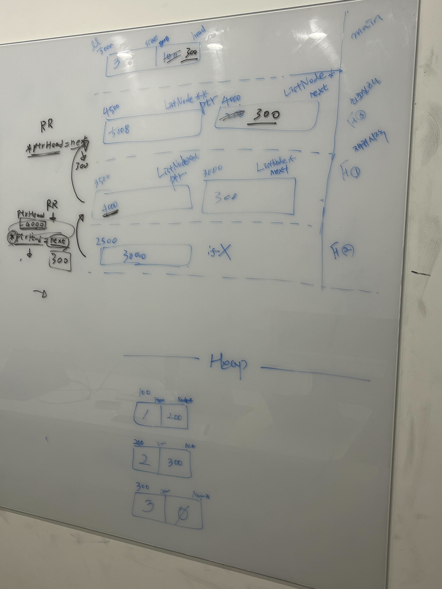

- 문제
  ```c
  void RecursiveReverse(ListNode** ptrHead) { /* 여기를 구현하시오. */ }
  ```

- 풀이 (메모리 보는게 해설인데, 아래에 있다.)
```c
//////////////////////////////////////////////////////////////////////////////////

/* CE1007/CZ1007 Data Structures
Lab Test: Section A - Linked List Questions
Purpose: Implementing the required functions for Question 7 */

//////////////////////////////////////////////////////////////////////////////////

#include <stdio.h>
#include <stdlib.h>

//////////////////////////////////////////////////////////////////////////////////

typedef struct _listnode {
    int item;
    struct _listnode* next;
} ListNode;  // You should not change the definition of ListNode

typedef struct _linkedlist {
    int size;
    ListNode* head;
} LinkedList;  // You should not change the definition of LinkedList

//////////////////////// function prototypes
////////////////////////////////////////

// You should not change the prototype of this function
void RecursiveReverse(ListNode** ptrHead);

void printList(LinkedList* ll);
void removeAllItems(LinkedList* ll);
ListNode* findNode(LinkedList* ll, int index);
int insertNode(LinkedList* ll, int index, int value);
int removeNode(LinkedList* ll, int index);

//////////////////////////// main()
/////////////////////////////////////////////////

int main() {
    LinkedList ll;
    int c, i, j;
    c = 1;
    // Initialize the linked list 1 as an empty linked list
    ll.head = NULL;
    ll.size = 0;

    printf("1: Insert an integer to the linked list:\n");
    printf("2: Reversed the linked list:\n");
    printf("0: Quit:\n");

    while (c != 0) {
        printf("Please input your choice(1/2/0): ");
        scanf("%d", &c);

        switch (c) {
            case 1:
                printf(
                    "Input an integer that you want to add to the linked "
                    "list: ");
                scanf("%d", &i);
                j = insertNode(&ll, ll.size, i);
                printf("The resulting linked list is: ");
                printList(&ll);
                break;
            case 2:
                RecursiveReverse(&(ll.head));  // You need to code this function
                printf(
                    "The resulting linked list after reversed the given linked "
                    "list "
                    "is: ");
                printList(&ll);
                removeAllItems(&ll);
                break;
            case 0: removeAllItems(&ll); break;
            default: printf("Choice unknown;\n"); break;
        }
    }
    return 0;
}

////////////////////////////////////////////////////////////////////////

void RecursiveReverse(ListNode** ptrHead) {
    if (!*ptrHead || !(*ptrHead)->next)  // 변수하나 할당하는 것도 오버헤드다
        return;

    ListNode* next = (*ptrHead)->next;

    // A: bad
    /* RecursiveReverse(&(*ptrHead)->next); */
    // B: good
    RecursiveReverse(&next);

    (*ptrHead)->next->next = (*ptrHead);
    (*ptrHead)->next = NULL;

    *ptrHead = next;
}

//////////////////////////////////////////////////////////////////////////////////

void printList(LinkedList* ll) {
    ListNode* cur;
    if (ll == NULL)
        return;
    cur = ll->head;

    if (cur == NULL)
        printf("Empty");
    while (cur != NULL) {
        printf("%d ", cur->item);
        cur = cur->next;
    }
    printf("\n");
}

ListNode* findNode(LinkedList* ll, int index) {
    ListNode* temp;

    if (ll == NULL || index < 0 || index >= ll->size)
        return NULL;

    temp = ll->head;

    if (temp == NULL || index < 0)
        return NULL;

    while (index > 0) {
        temp = temp->next;
        if (temp == NULL)
            return NULL;
        index--;
    }

    return temp;
}

int insertNode(LinkedList* ll, int index, int value) {
    ListNode *pre, *cur;

    if (ll == NULL || index < 0 || index > ll->size + 1)
        return -1;

    // If empty list or inserting first node, need to update head pointer
    if (ll->head == NULL || index == 0) {
        cur = ll->head;
        ll->head = malloc(sizeof(ListNode));
        ll->head->item = value;
        ll->head->next = cur;
        ll->size++;
        return 0;
    }

    // Find the nodes before and at the target position
    // Create a new node and reconnect the links
    if ((pre = findNode(ll, index - 1)) != NULL) {
        cur = pre->next;
        pre->next = malloc(sizeof(ListNode));
        pre->next->item = value;
        pre->next->next = cur;
        ll->size++;
        return 0;
    }

    return -1;
}

int removeNode(LinkedList* ll, int index) {
    ListNode *pre, *cur;

    // Highest index we can remove is size-1
    if (ll == NULL || index < 0 || index >= ll->size)
        return -1;

    // If removing first node, need to update head pointer
    if (index == 0) {
        cur = ll->head->next;
        free(ll->head);
        ll->head = cur;
        ll->size--;

        return 0;
    }

    // Find the nodes before and after the target position
    // Free the target node and reconnect the links
    if ((pre = findNode(ll, index - 1)) != NULL) {
        if (pre->next == NULL)
            return -1;

        cur = pre->next;
        pre->next = cur->next;
        free(cur);
        ll->size--;
        return 0;
    }

    return -1;
}

void removeAllItems(LinkedList* ll) {
    ListNode* cur = ll->head;
    ListNode* tmp;

    while (cur != NULL) {
        tmp = cur->next;
        free(cur);
        cur = tmp;
    }
    ll->head = NULL;
    ll->size = 0;
}
```



