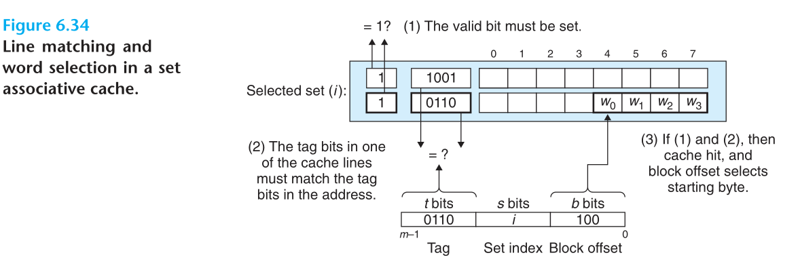

# Chapter.6 메모리 계층구조


[notebookLM](https://notebooklm.google.com/notebook/f405095d-572f-4992-bf85-e8781645f33a)


- **이 챕터의 목표:**

  메모리 계층(Memory Hierarchy)이 프로그램 성능에 미치는 영향을 이해하고,
  이를 활용하여 더 빠른 프로그램을 작성하는 방법을 배우는 것이다.
  

    - 서로 다른 저장 기술(SRAM, DRAM, 디스크)의 특성과 성능 차이를 이해
    - **지역성(locality)** 의 원리를 파악하고 캐시 친화적인 코드를 작성
    - 메모리 계층의 성능을 시각적으로 분석하는 Memory Mountain과 같은 개념을 통해
      프로그램의 성능을 예측하고 최적화


---

- **목차**

  1. Storage Technologies
  2. Locality
  3. The Memory Hierarchy
  4. Cache Memories
  5. Writing Cache-Friendly Code
  6. Putting It Together: The Impact of Caches on Program Performance


> [!rf]
> 
> [캐시 설명 강의](https://www.youtube.com/watch?v=Bz49xnKBH_0)
> 다른것도 잘 설명하겠지..? 여타 파트도 활용하자


---


> [!td]
>
> - [ ] `#### 계층별 설명` 이부분에서 담당을 누가하는지에 따른 메커니즘을 알고있으면 좋겠다.
> - [ ] `쓰기 관련 문제`
> - [ ] `I-Cache (명령어) 와 D-Cache (데이터)`
> - [ ] `Putting It Together: The Impact of Caches on Program Performance`


## Specially Ah-Ha!


### A


_아래 자료에 대하여,_

- 6.2.1 Locality of References to Program Data

Consider the simple function in Figure 6.17(a) that sums the elements of a vector.
Does this function have good locality? To answer this question, we look at the
reference pattern for each variable. In this example, the sum variable is referenced
once in each loop iteration, and thus there is good temporal locality with respect
to sum. On the other hand, since sum is a scalar, **there is no spatial locality with
respect to sum.**

```c
int sumvec(int v[N]) {
    int i, sum = 0;

    for (i = 0; i < N; i++)
        sum += v[i];

    return sum;
}
```
- Figure 6.17 (a) A function with good locality. 


> [!qt] 왜 공간 지역성이 없다고 할까?
>
>  특히 반복문 내 구문에서 sum과 i값을 한번에 사용하고 있고, 이놈들은 스택에 연속적으로
>  있을테니까 캐싱 되는 Block단위에 분명 묶일텐데?
>
>   󱞪 컴파일러는 스칼라 변수의 시간 지역성이 좋다고 판단하면 **레지스터에** 계속 캐싱해두고 사용한다.
>
>
> > [!NOTE] 스칼라변수?
> >
> > 배열처럼 sequencial한 변수가 아닌 단일값을 뜻함


### B


  
> [!qt] 캐싱이 이루어진다면 왜 debugger에서는 보여지지 않는걸까? 가상메모리가 아니라 캐시메모리에서 가져오는 경우가 많을텐데?
>
>   󱞪 CPU는 instruction 실행만 상관한다. 주 메모리에서 가져오는지 캐시메모리에서 가져오는지 알필요도 없다.
>
> 캐싱은 하드웨어 레벨에서 일어나는 일이다. 순서는 이렇다.
>
>   1. 프로세서가 instruction 실행
>   2. AGU에서 주소계산
>   3. MMU가 계산된 주소 받아서 Physical Address로 변환
>   4. **(하드웨어 레벨에서)** 캐시메모리 위계에 따라 데이터를 찾아 내려간다.


> [!NOTE] 캐시 Hit/Miss 성능을 측정하는 소프트웨어 `perf`
>
> `perf`
> [analyze-cache-misses](https://www.baeldung.com/linux/analyze-cache-misses)
> [about_perf by redhat](https://docs.redhat.com/ko/documentation/red_hat_enterprise_linux_for_real_time/7/html/tuning_guide/about_perf)
>
> - example
>   ```bash
>   perf report -v
>   
>    Samples: 48K of event 'cache-misses'
>   # Event count (approx.): 23918294
>   #
>   # Overhead  Command      Shared Object             Symbol
>   # ........  .......  ...................  .....................
>   #
>       100.00%  test_program  [.] main
>             |
>             |--85.42%-- function_A
>             |          |
>             |          |--60.22%-- sub_function_X
>             |          |          sub_function_Y
>             |          |
>             |          |--25.20%-- sub_function_Z
>             |
>             |--14.58%-- function_B
>                        |
>                        |--12.03%-- sub_function_P
>                        |          sub_function_Q
>                        |
>                        |--02.55%-- sub_function_R
>   ```

### C

> [!qt] (프로세스)컨텍스트 스위칭이 발생하면 cache memory까지 다 스위칭 되는건가?
>
>   󱞪  No, it's not.
> 
> 
> - **Context Switching Basics**: When switching processes, the CPU saves the current process's
>   register state (e.g., PC, SP, general registers) **to the kernel stack or PCB** in virtual memory.
>   It then loads the saved state of the next process, replacing the old context.
> 
>   > [!NOTE] collaboration of kernerl stack with PCB: `context switching`-wise
>   >
>   > - How They Work Together:
>   >   - During context switching, the CPU might temporarily save register states onto
>   >     the kernel stack for quick access during kernel operations or interrupts.
>   >   - These states are then transferred or stored in the PCB for persistent process context. The
>   >     PCB holds the full snapshot, while the kernel stack handles runtime stack operations.
>   >   - For example, in Linux, the PCB (task_struct) includes a pointer to the kernel stack,
>   >     allowing the kernel to manage both.
>   > 
>   > - Not Included Under Kernel Stack: The PCB is a distinct data structure allocated in kernel
>   >   memory (often in a linked list or table), not part of the stack itself. The stack is a
>   >   contiguous memory region for function calls, whereas the PCB is a structured record.
>   > 
>   > - This collaboration ensures efficient switching without losing state.
> 
> 
> - **Data Handling**: Process data in memory (heap, stack) stays in place but is accessed via the
>   process's virtual address space, switched through page tables.
> 
> 
> - **Cache Management**: L1-L3 caches are **not** flushed per process; they use physical addresses and tags,
>   so cached data from the old process may persist, potentially lowering hit rates for the new
>   process initially.
> 
>   The TLB is flushed/reloaded for address mappings, but caches rely on hardware replacement policies.


## Storage Technologies


_각 기술의 물리적 한계와 발전 속도의 차이가 어떻게 메모리 계층 구조라는 필연적인 설계로 이어졌는가_


### RAM (Random Access Memory)


> [!NOTE]
> capacitor: 전하를 저장
> transistor: 전류의 저항을 조절, 스위치 역할


#### SRAM(정적 RAM)

각 비트를 6개의 transistor로 구현한 회로에 저장

- 활용
  - CPU 레지스터
  - 캐시 메모리(L1, L2, L3)

- 장점
  - 전원이 공급되는 한 데이터를 유지
  - 외부 교란에 강함
    - 전기적 노이즈: 전원 공급의 불안정, 주변 회로에서 발생하는 전자기파,
      외부에서 정전기, 우주에서 오는 고에너지 입자(코스믹 레이)
  - 속도가 빠름

- 단점
  - 구조가 복잡해 밀도가 낮음
  - 비쌈
  - 전력 소모가 큼


#### DRAM(동적 RAM)

각 비트를 하나의 capacitor와 transistor로 구현하여 저장

- 활용
  - 메인 메모리

- 장점
  - 구조가 단순해 밀도가 높음
  - 값이 싸다

- 단점
  - SRAM보다 느림
  - 전하가 빨리 유실되므로 주기적인 재충전이 필요


##### DRAM의 구조: "memory module"

- **관련 개념의 집합 관계** 
  - memory module = _set of_ memory chips
  - memory chips  = _set of_ super cells
  - super cells   = _set of_ cells


- **memory chip:** 수 많은 cell(capaciter+transitor)로 구성된 DRAM chip을 뜻함

  - cell: 1bit를 저장하는 단위
    - row를 표현하는 word line. RAS에 반응
    - column을 표현하는 bit line. CAS에 반응
    - 두 lines가 교차하는 부분이 cell

  - ex) 8M x 8 규격의 DRAM chip이란,
    - 8백만개 고유주소(슈퍼셀 1개마다 1개 주소)를 가지며 주소마다 8비트씩 입출력 가능하다는 뜻
    - 이때의 슈퍼셀(supercell)은 이 8bit 묶음이 됨
    - 즉, 8백만개의 슈퍼셀이 있는 셈


- **memory module:** 수 많은 memory chip의 묶음

  - memory chip 하나로는 bus에 담아줄 word 크기를 못채운다.
    - chip 하나에 슈퍼셀 하나씩 입출력 하니까
  - 그래서 RAS/CAS를 통해 하나의 주소를 8개의 DRAM 칩에 병렬적으로 보낸다.
  - 그러면 각각의 칩에서 1개씩의 슈퍼셀(8bit)을 읽어낸다.
  - 메모리 모듈의 데이터버스 및 조합 회로에서 word 크기로 합쳐준다.
    - 이때 조합하는 순서는 리틀 엔디안 또는 빅 엔디안 방식에 따른다.
  - 이 최종 결과를 memory bus에 담아 보낸다.


##### Memory Controller (I/O bridge에 포함)

_CPU와 DRAM 사이의 데이터 흐름을 관리하는 하드웨어_


> [!NOTE] 트랜잭션(transaction)
> 버스를 통해 데이터를 주고받는 하나의 완전한 과정. read/write 두 가지


> [!NOTE] DRAM의 인덱싱: supercell의 주소
> - RAS:    Row Access Strobe. 느림(상대적으로)
> - CAS: Column Access Strobe. (상대적으로)빠름
>
>
> > [!NOTE] "strobe"란?
> >
> > - 전자공학에서 **순간적으로 신호를 보내어 어떤 동작을 트리거(trigger)하는 제어 신호**


> [!NOTE] control wires(제어 와이어): system bus의 일부로, 오가는 정보의 종류와 흐름을 통제하는 신호
> - transaction 종류 식별: read / write 식별
> - 정보 유형 구분: 버스에 실린 데이터가 '주소'인지 '데이터'인지 식별
> - 대상 장치 지정: 대상지(목적지)가 주기억장치인지 기타 I/O 장치인지 식별


###### Read Transaction

_1. CPU  ---주소 전송--> DRAM_
_2. CPU <--데이터전송--  DRAM_


ex)`movq A-addr, %rax` 명령을 수행하는 과정

   > 1. CPU(내부의 bus interface)가 A주소를 system bus에 싣는다.
   > 2. Memory Controller(I/O bridge 일부)가 받고 control wires를 통해 read/write 여부를 구분 
   > 3. A주소를 RAS/CAS 요청으로 변환, memory bus로 DRAM에 전달
   >    - RAS 먼저 요청해서 전체 행 값(수 KB)을 DRAM 칩 내부의 행 버퍼(internal row buffer)로 복사
   >    - CAS 요청을 통해 행 버퍼에서 정확한 데이터(슈퍼셀 하나)를 찾아냄
   > 4. DRAM이 찾아낸 데이터를 memory bus에 싣는다. 
   > 5. Memory Controller가 이것을 받아서 system bus로 보낸다.
   > 6. CPU bus interface가 읽음


> [!NOTE] 메모리 칩의 동작 및 RAS와 '지역성'
>
> - chip 내에 하나의 행은 엄청나게 많은 supercell을 가지고 있다.
> - 예를들어, 8M x 8bit 메모리칩은 2048 row * 4096 column으로 구성될 수 있는데
>   이러면 RAS로 1행을 읽을 때 4096개의 슈퍼셀, 즉 4096 Byte == 4KB을 한번에 읽는다.
> - **따라서, 만약 동일한 행에 있는 값을 연속적으로 읽는다면 추가적인 RAS 요청은 생략할 수
>   있다.** **(공간적 지역성이 활용되는 예시)**
>
> - FPM(Fast Page Mode)기술이 바로 이렇게 RAS 요청을 생략하는것을 가능케 한다.
>   이 기술이 없을 땐 RAS로 읽어와 행 버퍼에 저장해둔 값을 날려버렸고,
>   이 기술은 그것을 유지해주는 기술이다.


###### Write Transaction
 
_1. CPU --주소 전송---> DRAM_
_2. CPU --데이터전송--> DRAM_

ex)`moveq %rax, A-addr` 명령을 수행하는 과정

   > 1. CPU(내부의 bus interface)가 A주소를 system bus에 싣는다.
   > 2. Memory Controller(I/O bridge 일부)가 받고 control wires를 통해 read/write 여부를 구분 
   > 3. A주소를 RAS/CAS 요청으로 변환, memory bus로 DRAM에 전달
   >    - RAS 먼저 요청해서 전체 행 값을 DRAM 칩 내부의 행 버퍼(internal row buffer)로 복사
   > 4. 이어서 system bus로부터 받게되는 데이터와 함께 CAS를 전달
   > 5. DRAM은 지정된 column에 데이터를 '쓰기'한다.


### 비휘발성 메모리 (Nonvolatile Memory)


- 전원 공급이 중단된 상태에서도 정보를 유지하는 저장장치


#### ROM (Read-Only Memory)


- 역사적 맥락에서 ROM(Read-Only Memories)로 통칭 
- 일부 유형은 쓰기(Write)도 가능

  > - PROM(Programmable ROM): 1회 쓰기 가능
  > 
  > - EPROM(Erasable Programmable ROM): 1,000회 정도 지우고 쓰기 가능
  > 
  > - EEPROM(Electrically Erasable PROM): 
  >   물리적으로 분리된 프로그래밍 장치가 필요 없고 **인쇄 회로 기판 위 제자리에서**
  >   약 100,000회 쓰기 가능


#### 플래시 메모리 (Flash Memory)


- EEPROM 기반으로 발전
- 내구성 좋음
- 전력 소모 낮음


#### 펌웨어(Firmware)의 역할

- ROM 장치에 저장된 **프로그램**
- 컴퓨터 시스템이 작동하는 데 필수적인 저수준 기능
  1. 시스템 부팅
  2. I/O 기능
  3. 장치 제어


### 회전 디스크

- 주기억장치(DRAM)보다 느림(Read/수천 배)

- 구조: 플래터, 트랙, 섹터, 실린더

  [참고영상1](https://www.youtube.com/watch?v=7n71z7KIoXo)
  [참고영상2](https://www.youtube.com/shorts/KH9mZB5nR7s)


  - 플래터(platter)라는 양면이, 자기기록 물질로 코팅된 1장 이상의 원형 판으로 구성
    - 각 플래터 표면은 트랙(tracks)으로 구성, 트랙은 섹터(sectors)로 분할
    - 각 섹터는 일반적으로 512 Byte
    - 섹터 단위로 데이터를 Read/Write
    - 섹터의 칸칸에 자기장을 활용해 1과 0을 구분하는 방식
  - 각 플레터에는 데이터를 Read/Write하는 헤드가 있음
  - 모든 헤드는 동일한 실린더에 위치(제각각이 아님)

  - 실린더(cylinder):
    - 실린더는 스핀들(spindle) 중앙으로부터 동일한 거리에 있는 모든 표면의 (수직)트랙 컬렉션을 뜻함

  - 블록(Block): OS의 논리적 추상화 단위
    - 다중 플래터 트랙 섹터 등등 다 필요 없고 그냥 '블록의 연속'이라고 추상화하여 사용
    - 블록 크기는 섹터 크기와 같음
    - 디스크 컨트롤러가 **메모리 맵 I/O 메커니즘**을 통해 추상화된 블록을 통한 CPU 명령을 실제
      디스크에 적용할수 있도록 해석
  


#### 디스크 접근 시간 (Seek + Rotational Latency + Transfer)

- 탐색시간
  - 대상 섹터가 포함된 트랙으로 헤드가 움직이는 시간
  - 현대엔 일반적으로 3ms에서 9ms 정도

- 회전 지연시간
  - 정확한 섹터 위로 헤드가 위치할 때까지 플래터를 돌리는 시간
  - 회전 속도에 따라 다르고 또 시작 위치와 대상 섹터의 거리에 따라 다름
  - 이것도 수ms 정도

- 전송시간
  - 탐색 및 회전을 완료한 시점부터 시간을 재는데, 거의 의미없다.


#### 논리적 블록 (Logical Disk Blocks) 및 디스크 컨트롤러


- 디스크 컨트롤러(Disk Controller):

  - 디스크 패키지 내부에 있는 작은 하드웨어/펌웨어 장치
  - 논리적 블록 번호와 실제 물리적 섹터 주소 (표면, 트랙, 섹터) 간의 매핑을 유지 관리


- DMA(Direct Memory Access)

  - **CPU의 개입 없이** 데이터를 주기억장치로 직접 Read/Write
  - **디스크 I/O 속도가 매우 느리기 때문에** CPU가 대기하는 비효율을 막기 위한 메커니즘

  - **읽기:** CPU가 디스크의 데이터를 주 메모리로 Load

    > 1. CPU의 요청 시작:
    >    - "읽어라"
    >    - "이 부분"(논리적 블록 번호 I/O port)
    >    - "여기에 복사"(데이터가 저장될 주 메모리 주소)
    >
    > 2. CPU 독립 작업:
    >    요청 후, 디스크 I/O 작업이 완료되는 긴 시간 동안 CPU는 다른 작업을 수행
    >
    > 3. DMA 전송:
    >    - 디스크 컨트롤러는 논리적 블록 번호를 실제 디스크 섹터 주소로 변환하여 데이터를 읽기
    >    - 읽은 데이터를 주 메모리로 직접 전송(DMA 전송)
    >
    > 4. CPU 알림:
    >    DMA 전송이 완료되면, 디스크 컨트롤러는 **인터럽트 신호**를 CPU에 보내 완료 통지


  - **쓰기:** CPU가 주 기억장치 메모리 내용을 디스크 주소 A에 저장

    > 1. CPU의 요청 시작:
    >    - "써라"(CPU는 디스크 컨트롤러에 명령)
    >    - "이 부분에"(논리적 블록 번호 I/O port)
    >    - "여기서 복사 해 와서"(데이터가 저장되어있는 주 메모리 주소)
    >
    > 2. CPU 독립 작업:
    >    요청 후, 디스크 I/O 작업이 완료되는 긴 시간 동안 CPU는 다른 작업을 수행
    >
    > 3. DMA 전송 및 저장:
    >    - 디스크 컨트롤러는 CPU 개입 없이 메모리 버스를 통해 주 메모리에서 데이터를 가져와서
    >      디스크에 저장


### SSD (Solid State Disks)


- 플래시 메모리 기반

  - 플래시 메모리 칩 + '디스크 컨트롤러'와 같은 역할을 하는 플래시 변환 계층

    > [!NOTE] 플래시 변환 계층(Flash translation layer)
    >
    > - OS의 파일 시스템 요청(Read/Write/Delete)을 플래시 메모리의 특성에 맞게 변환해주는
    >   소프트웨어 계층
    > - 플래시 메모리는 쓰기(W)전에 반드시 지워야 함
    > - 논리적 주소를 실제 물리적 주소로 바꿔주는 역할 등


- 표준 디스크 슬롯(일반적으로 USB 또는 SATA)에 연결


#### 기존의 회전 디스크와 비교

- SSD는 움직이는 부품이 없다.
  - 빠름
  - 어느 주소에 접근하든 접근 시간이 동일함
  - 전력소모 적음
  - 견고함

- 하지만,
  - 30배 비싸고
  - 반복적 쓰기 작업 후 마모되는 잠재적 문제가 있음
    - 마모된 부분은 Read/Write가 안될 수 있음. Bad Block이라고 부름


#### 구조적 특징 및 쓰기 문제


- 플래시는 블록(Block)의 연속으로 추상화
- 각 블록(Block)은 여러 페이지(Page)를 포함
- 이때의 Page단위로 Read/Write
- 용량
  - 512 Byte ~ 4KB / Page
  - 32 ~ 128 Pages / Block


- **독특한 쓰기 메커니즘:**

  - 페이지에 데이터를 쓰기 전에 해당 페이지가 속한 전체 블록을 먼저 지워야 함
    - 일반적으로 모든 비트를 1로 설정
    - 지운 후에 블록 내의 각 페이지를 추가적인 지우기 없이 한 번씩 쓰기 가능

  - 읽기보다 느림
    1. 블록을 지우는데 (Read/Write 대비)상대적으로 긴 시간이 소요
    2. 기존 데이터라도 있으면 다른데 옮겨야 함


- 내구성 및 마모
  - 플래시 메모리 특성상 블록은 반복적 쓰기로 인해 마모됨
  - 수명은 100,000회 쓰기 정도
  - Wear-leveling(마모 평준화) 기능으로 쓰기 작업이 모든 블록에 분산될 수 있도록 함


## Locality

_메모리의 시간적/공간적(Temporal Locality / Spatial Locality)으로 인접한 영역을 더 많이 접근하는 경향_


- 시간 지역성
  - 최근 참조된 항목 재참조 가능성
  - 캐싱의 근거

- 공간 지역성
  - 최근 참조된 항목 근처 참조 가능성


- 예시

  - Stride-1 패턴 (좋은 공간 지역성)
    - 각 요소를 메모리에 저장된 순서대로 순차적으로 방문하는 패턴
    - 보폭(Stride)이 증가할수록 공간 지역성은 감소하며, Stride-1 패턴이 가장 좋음 


  - 루프 (좋은 명령어 인출 지역성) 

    - 루프(Loops)는 프로그램 명령어 인출(Instruction Fetches) 측면에서 탁월한 지역성을 제공
    - 프로그램 명령어 또한 메모리에 저장되어 있으며, CPU가 실행을 위해 메모리로부터 명령어를 인출(fetch)해야 함
    - 좋은 시간 지역성과 공간 지역성을 모두 가짐
      | 지역성 유형 | 루프의 특성            | 설명                                                                                                                      |
      |-------------|------------------------|---------------------------------------------------------------------------------------------------------------------------|
      | 공간 지역성 | 순차적 명령어 인출     | 프로그램 명령어들은 메모리에 연속적으로 저장되어 있음. 루프는 명령어를 순차적으로 인출하므로 좋은 공간 지역성을 보임      |
      | 시간 지역성 | 반복적인 명령어 재사용 | 루프 본체는 여러 번 실행됨. 따라서 최근에 참조된 명령어들이 가까운 미래에 반복적으로 재참조되므로 좋은 시간 지역성을 누림 |

    - 루프 **본체가 작을수록** 지역성이 더 좋음.
    - 루프 **반복 횟수가 많을수록** 지역성이 더 좋음.


### 지역성이 어디에 어떻게 적용되었나?

- **Cache Memories**: Caches store frequently accessed data closer to the CPU to reduce access time.
  Temporal locality ensures recently used data stays in cache, while spatial locality prefetches
  nearby data.

  - _Example_: In a loop summing array elements (e.g., `for (int i = 0; i < n; i++) sum += arr[i];`),
    the array elements are accessed sequentially (spatial) and repeatedly (temporal),
    minimizing cache misses.


- **Paging Mechanisms**: Virtual memory uses paging to swap data between RAM and disk. Replacement
  algorithms like Least Recently Used (LRU) prioritize evicting pages with poor temporal locality,
  keeping recently accessed ones in memory.

  - _Example_: When loading a program, pages containing code and data accessed early (e.g., main
    function) are retained, while unused library pages might be swapped out, improving overall
    responsiveness.


- **Disk I/O**: Disk controllers optimize reads/writes by grouping operations on contiguous sectors,
  leveraging spatial locality to reduce seek times. 

  - _Example_: Reading a large file sequentially (e.g., via `fread` in C) loads adjacent sectors
    into buffers, faster than random access to scattered blocks.


- **File Systems**: File systems cluster related data (e.g., directories and files) on nearby disk
  blocks to exploit spatial locality, reducing fragmentation and access overhead.

  - _Example_: In NTFS or ext4, storing a directory's files contiguously means listing contents or
    opening a file involves fewer disk seeks compared to scattered storage.


## The Memory Hierarchy


### L0 (CPU 레지스터) 부터 L6 (원격 서버 디스크) 까지


메모리 계층 구조는 용량, 비용, 접근 시간이 서로 다른 저장 장치들을 계층적으로 조직하여,
프로그램의 지역성 원칙을 활용해 전체 시스템 성능을 최적화하는 근본적인 원리임

- **프로그래밍 관점:**
  프로그래머는 데이터 항목이 CPU가 더 빠르게 접근할 수 있는 상위 레벨에
  저장되도록 프로그램을 작성함으로써 성능을 향상시킬 수 있음


#### 계층별 설명

- **L0: CPU 레지스터 (Registers)**
  - _저장 장치:_ CPU 레지스터 파일
  - _주요 데이터:_ 가장 자주 사용되는 워드(Words)
  - _특징:_ 접근 시간은 0 사이클로 가장 빠름. **컴파일러가 관리**
    - 컴파일러로 실행파일을 만드는 시점에서 레지스터의 사용방법이 정해지기 때문

- **L1, L2, L3: 캐시 메모리 (Cache Memories)**
  - _저장 장치:_ SRAM 기반의 작고 빠른 메모리
  - _역할:_ 주 메모리의 데이터와 명령어를 스테이징함
  - _세부 레벨 특징:_
    - L1 캐시: 접근 시간은 약 4 사이클임.
    - L2 캐시: 접근 시간은 약 10 사이클임.
    - L3 캐시: 접근 시간은 약 40~75 사이클임.
  - _관리:_ 캐싱 로직은 **하드웨어에 의해 전적으로 관리됨**

- **L4: 주 메모리 (Main Memory)**
  - _저장 장치:_ DRAM 기반의 크고 저렴한 메모리
  - _역할:_ 로컬 디스크에 저장된 데이터 블록(페이지)을 위한 캐시 역할을 수행함
  - _특징:_ 접근 시간은 수백 사이클에 달함
  - _관리:_ **운영체제 소프트웨어와 주소 변환 하드웨어(MMU)의 조합으로 관리됨**

- **L5: 로컬 보조 저장소 (Local Secondary Storage)**
  - _저장 장치:_ 로컬 디스크 (회전 디스크 또는 SSD)
  - _역할:_ 원격 네트워크 서버에 저장된 파일들을 스테이징함
  - _특징:_ 접근 시간은 수천만 사이클에 달하며, 매우 느림

- **L6: 원격 보조 저장소 (Remote Secondary Storage)**
  - _저장 장치:_ 분산 파일 시스템이나 웹 서버의 디스크 등 네트워크로 연결된 저장소
  - _역할:_ 웹 페이지나 대용량 파일의 부분을 캐시함
  - _특징:_ 접근 시간은 수십억 사이클로 가장 느림


##### 모든 레벨은 하위 레벨의 데이터를 스테이징

| 레벨           | 캐시 장치        | 스테이징 대상 (하위 레벨)                      | 관리 주체                         |
|----------------|------------------|------------------------------------------------|-----------------------------------|
| **L0**         | CPU 레지스터     | 캐시 메모리(L1)에서 검색된 워드                | 컴파일러                          |
| **L1, L2, L3** | SRAM 캐시 메모리 | 주 메모리(DRAM)의 명령어 및 데이터 블록        | 하드웨어                          |
| **L4**         | 주 메모리 (DRAM) | 로컬 디스크의 데이터 블록 (가상 메모리 페이지) | 하드웨어 + OS                     |
| **L5**         | 로컬 디스크      | 원격 서버 디스크의 파일                        | OS (Buffer Cache), NFS 클라이언트 |
| **L6**         | 원격 저장소      | 웹 서버 등 원격 저장소의 파일                  | 웹 프록시 서버                    |


#### 캐싱 (Caching): 작고 빠른 장치가 크고 느린 장치의 데이터를 스테이징


- **레벨 간 관계:**

  계층 구조의 각 레벨 `k`에 있는 빠르고 작은 저장 장치는 다음 하위 레벨
  `k+1`에 있는 데이터 객체의 부분 집합을 **스테이징(staging)**하는 캐시 역할을 수행
  즉, 모든 레벨은 아래 레벨의 캐시 역할


- 지역성(Locality) 원칙의 활용


#### 2. 캐싱 메커니즘 및 작동 방식

캐싱 메커니즘은 데이터가 레벨 간에 어떻게 이동하고 접근되는지를 정의함.

- **데이터 전송 단위 (블록):** 데이터는 레벨 `k`와 `k+1` 사이에서 **블록(Block)** 이라는
  연속적인 데이터 덩어리 단위로 복사됨. 하위 레벨로 갈수록 접근 시간이 길어지므로, 이 긴 접근
  시간을 상쇄하기 위해 **일반적으로 더 큰 블록 크기**를 사용함.

    > [!qt] 이때 "더 큰 블록 크기"라 하면 접근하려는 데이터보다 더 큰 블록 크기를 사용한다는 말이야?
    >   󱞪  Yes.
    >
    > A "block" (or cache line/page) is typically larger than the specific data item you're trying
    > to access (e.g., a single word or byte). For example, if you request one byte, the system might
    > fetch a 64-byte cache line or a 4KB page that includes that byte plus surrounding data. This
    > leverages spatial locality to reduce future misses by bringing in nearby data preemptively.


- **캐시 적중 (Cache Hit):** 필요한 데이터가 레벨 `k`에 이미 저장되어 있을 때 발생함. 빠르고 참 좋다.

- **캐시 미스 (Cache Miss):** 다음 레벨에서 가져옴

- **블록 교체 (Replacement):** 캐시 미스 시 레벨 `k`의 저장 공간이 가득 찼다면,
  기존 블록 중 하나(victim block)를 **교체(evicting or replacing)해야 함**

  - 무작위 교체나 LRU(Least Recently Used) 등 방법도 여러가지


### 블록 (Block) 단위로 데이터 복사


_데이터 전송 단위를 정의_


- **크기 가변성:**
  특정 인접한 두 레벨 사이에서는 블록 크기가 고정되지만, 계층 구조의 다른 쌍의 레벨 간에는 블록
  크기가 다를 수 있음.

- **하위 레벨의 큰 블록:**
  계층 구조의 하위 레벨(CPU에서 멀어질수록)은 접근 시간이 더 길기 때문에, 이러한 긴 접근 시간을
  상쇄(amortize)하기 위해 일반적으로 더 큰 블록 크기를 사용함.


---


- **(Cache) Set:** Cache Line의 집합. 캐시메모리 안에는 다수의 캐시 세트가 존재
- **Cache Line:** 데이터 블록뿐만 아니라, 해당 **데이터의 상태를 관리하는 추가 정보를 포함**하여 저장하는 **컨테이너**

  - 추가정보
    - valid bit: 라인이 유의미한 정보를 담고있는지 아니면 비어있는지
    - tag bit: (캐시 라인에)저장된 데이터 블록이 주 메모리의 어떤 고유한 블록인지를 식별하는 데 사용
      실제 주소값의 일부분을 사용하여 캐시 내에 저장된 블록을 고유하게 식별

  - 캐시 적중의 판단에 이 추가정보를 사용
    - 조건1: 유효 비트가 설정됨
    - 조건2: 태그가 요청된 주소의 태그와 일치


  > [!NOTE] 캐시 라인이 많으면 캐시 히트 적중률이 좋으니까 좋은건가?
  >
  > 장단점이 있다.
  >
  > 히트율이 올라가는 반면 히트 시간도 길어질 수 있다.
  >
  > 블록 크기도 마찬가지인데, 크면 히트율이 좋겠지만 미스 페널티도 증가한다.
  > 따라서 대부분의 최신 시스템은 64 바이트 블록 크기를 절충안으로 사용한다.
  


#### 캐시의 분류

_세트당 라인 수에 따라 분류됨_

- 직접 매핑 캐시: 세트당 라인이 정확히 1개임 (`E=1`)
- 세트 연관 캐시: 세트당 라인이 1개보다 많음 (`1 < E < C/B`)
- 완전 연관 캐시: 전체 캐시가 1개 세트로 구성

- 예시
  (Intel Core i7 프로세서)
  | 캐시 유형            | 캐시 크기 (C) | 연관도 (E, Lines per Set) | 블록 크기 (B) | 세트 수 (S) |
  |----------------------|---------------|---------------------------|---------------|-------------|
  | **L1 i-cache**       | 32 KB         | 8                         | 64 Byte       | 64          |
  | **L1 d-cache**       | 32 KB         | 8                         | 64 Byte       | 64          |
  | **L2 unified cache** | 256 KB        | 8                         | 64 Byte       | 512         |
  | **L3 unified cache** | 8 MB          | 16                        | 64 Byte       | 8,192       |

  > [!NOTE] 블록 크기
  >
  > - cache line 하나의 크기
  >   - **cache miss 발생시 하위계층에서 하나의 블록을 가져오면 라인 하나를 채워준다.**
  > - 상식적으로 word size의 배수로 정해지는 것이 유리하겠다.

### Cache Hit (적중) / Miss (실패)


#### 캐시 적중 (Cache Hit)

- **작동 방식:**

  - CPU는 데이터를 캐시 레벨 `k`에서 직접 읽음
  - (예: 직접 매핑 캐시) 캐시 라인의 유효 비트가 설정되어 있고 라인의 태그 비트가 주소의 태그와
    일치할 때 적중으로 판단함
  - **적중 후에는 블록 오프셋 비트가 블록 내에서 원하는 워드의 시작 위치를 선택함**

- **성능 이점:**

  - 적중 시 데이터는 하위 레벨에서 읽는 것보다 훨씬 빠르게 처리됨
    - 얼마나 좋으냐? CPU 레지스터에서 데이터 접근은 0 사이클, L1 캐시에서는 4~75 사이클이
    소요되지만, 주 메모리는 수백 사이클이 걸리므로 속도 차이가 큼

  - 시간 지역성(Temporal Locality) 덕분에, 한 번 미스 후 캐시에 복사된 객체가 재사용되어 다수의
    후속 참조가 적중으로 처리됨
    즉, 계층 구조 덕분에 한번 cache miss가 발생해도 또 기회가 주어짐. 구관이 명관


#### 캐시 실패 (Cache Miss)


- 캐시가 가득 찬 경우, 기존 블록 중 하나를 **희생 블록(victim block)**으로 선정하여 교체(replacing
  or evicting)해야 하며, 이는 교체 정책(Replacement Policy, 예: LRU)에 따름


- 주요 유형

  - **강제 미스 (Compulsory Miss/Cold Miss):** 캐시가 비어 있는(Cold Cache) 상태에서 발생하는 최초 접근 미스임

  - **용량 미스 (Capacity Miss):**
    - 프로그램의 작업 집합(Working Set) 크기가 캐시의 전체 용량을 초과하여 발생함
    - 상식적으로 당연히 발생한다. 하위 캐시 안에 다 안담기는 크기의 데이터를 사용하면 당근
      미스가 나겠지

  - **충돌 미스 (Conflict Miss):**

    - 캐시 용량이 충분하더라도, 주 메모리의 여러 블록이 캐시의 동일한 세트(Set)에 매핑되어 발생
      (**배치 정책(Placement Policy)**)

    - 이로 인해 캐시가 반복적으로 블록을 로드하고 축출하는 **스레싱(thrashing)** 현상이 발생

    * 특히 배열 크기가 2의 거듭제곱일 경우, '_Direct-Mapped Cache_'에서 충돌 미스가 흔히 발생

      - Direct-Mapped Cache (직접 매핑 캐시)
        : each memory block from main memory maps to exactly one specific cache line


## Cache Memories


현대의 프로세서는 일반적으로, 코어마다 독립적인

  - L1 i-cache (명령어 캐시),
  - L1 d-cache (데이터 캐시),
  - L2 통합 캐시

를 가지며,

모든 코어가 하나의

  - L3 통합 캐시를

공유한다.


### L1, L2, L3 캐시


- **기술적 기반:** L1, L2, L3 캐시는 모두 SRAM(Static RAM) 기술

- **하드웨어 관리:** 이 캐시들은 전적으로 캐시에 내장된 하드웨어 논리(hardware logic)에 의해 관리됨.

  > [!NOTE] Hardware logic
  >
  > Refers to **dedicated electronic circuits** (transistors, gates, comparators) built into the
  > CPU or cache chip.
  >
  > These circuits automatically handle cache operations like checking tags, managing hits/misses,
  > and evictions; all in hardware, without any software running.
  >
  > It's fixed and not programmable like software.


- **접근 속도:** CPU에 가까울수록 접근 시간이 짧아짐
  - L1 캐시: 약 4 클럭 사이클 소요
  - L2 캐시: 약 10 클럭 사이클 소요
  - L3 캐시: 약 40~75 클럭 사이클 소요

- **성능 전략:** 하위 레벨(L3) 캐시는 미스 페널티(Miss Penalty)가 더 높기 때문에, 일반적으로 
  L1 캐시보다 높은 연관도(Associativity)를 사용하여 충돌 실패(Conflict Miss) 발생 가능성을 낮추는
  경향이 있음.

  - '_높은 연관도_'를 사용한다는 것은 단일 `Set`에 더 많은 `cache lines(blocks)`를 넣어서 많은 양을
    조회하는것


#### 2. Intel Core i7 캐시 조직 상세

Intel Core i7 프로세서에서 L1, L2, L3 캐시는 모두 CPU 칩 내부에 포함되어 있으며, 그 조직이
분리되어 효율성을 높임.


- **L1 캐시 (분리형)**
  - L1 캐시는 명령어만 보관하는 **i-cache**와, 데이터만 보관하는 **d-cache**로 분리되어 있음.
  - 각 코어(core)는 자체적인 L1 i-cache와 L1 d-cache를 가짐.
  - L1 i-cache 및 d-cache의 주요 특성:
    - 접근 시간: 4 사이클임
    - 용량: 32 KB임
    - 연관도(E): 8-way임
    - 블록 크기(B): 64 Byte

- **L2 캐시 (통합형)**
  - L2 캐시는 명령어와 데이터를 모두 보관하는 **통합 캐시(unified cache)**임.
  - 각 코어는 자체적인 L2 통합 캐시를 가짐.
  - L2 통합 캐시의 주요 특성:
    - 접근 시간: 10 사이클임
    - 용량: 256 KB임
    - 연관도(E): 8-way임
    - 블록 크기(B): 64 Byte

- **L3 캐시 (통합형, 공유)**
  - L3 캐시는 명령어와 데이터를 모두 보관하는 통합 캐시임.
  - L3 캐시는 CPU 칩 내의 모든 코어가 **공유**함.
  - L3 통합 캐시의 주요 특성:
    - 접근 시간: 40–75 사이클임
    - 용량: 8 MB임
    - 연관도(E): 16-way임. _L3캐시라 캐시미스의 페널티를 고려하여 연관도를 높게 적용해 제작_
    - 블록 크기(B): 64 Byte


### 캐시 조직(구조) $(S, E, B, m)$


- 캐시 조직(Cache Organization)은 캐시 메모리가 RAM 주소를 캐시 내의 특정 위치에
  효율적으로 매핑하고 데이터를 저장 및 검색하기 위해 사용하는 기본 **구조**


- 특정 매개변수 집합 $(S, E, B, m)$에 의해 특징지어짐
  - 캐시 메모리의 하드웨어 스펙을 구성
  - 이들은 캐시의 구조와 동작 방식을 정의


| 매개변수 | 의미                   | 설명                                                                                       |
|----------|------------------------|--------------------------------------------------------------------------------------------|
| $m$      | 물리적 주소 비트 수    | 주 메모리의 고유한 주소 수를 결정하는 비트 수 ($M = 2^m$).                                 |
| $B$      | Block Size            | 각 캐시 라인이 저장하는 데이터 블록의 크기($B = 2^b$ 바이트). $b$는 블록 오프셋 비트 수임. |
| $S$      | Number of Sets        | 캐시가 조직된 캐시 세트 배열의 수($S = 2^s$). $s$는 세트 인덱스 비트 수임.                 |
| $E$      | Lines per Set (연관도) | 각 세트(Set)에 포함되는 캐시 라인(Cache Line)의 수.                                        |
  - 이 매개변수들을 통해 캐시 용량(Capacity, $C$)을 계산할 수 있음.
    - 캐시 용량은 블록들을 집계한 전체 크기로 정의되며, 태그 비트나 유효 비트는 포함하지 않음
      ($C = S \times E \times B$)


### 주소 분할과 캐시 히트(Hit)


- 주소분할이란:

  - RAM의 특정 주소에 있는 데이터를 빠르고 효율적으로 찾기 위한 방법
  - 메모리 (physical)주소를 세 가지 필드로 분할하여 캐시가 마치 해시 테이블처럼 작동하게 함

    - Tag
    - Set Index
    - Block Offset


    > [!NOTE] Physical vs. Virtual Addresses AROUND Memory Hierarchy
    >
    > - **Physical Address**: The actual hardware-level address used to access data in RAM. It's what
    >   the cache uses for lookups, divided into Tag (identifies the block), Set Index (selects the
    >   cache set), and Block Offset (locates data within the block), treating the cache like a hash
    >   table.
    >
    > - **Virtual Address**: A logical address in the program's memory space (e.g., from `&variable` in
    >   C). It's translated to physical by the MMU for security and flexibility.
    >
    > - **Size**: Both are typically 64 bits in modern 64-bit systems, though physical addresses may use
    >   fewer bits due to hardware limits.
    >
    > - **MMU Role**: The Memory Management Unit translates virtual addresses (from CPU) to physical
    >   ones, enabling cache operations on physical memory.
    >
    > - **Key Flow**: `CPU` → Virtual Address → `MMU` Translation → Physical Address → `Cache` Lookup/Access.


#### 주소 분할의 기본 구성

- $m$ 비트의 주소는 캐시의 매개변수에 기반하여 세 가지 필드로 나뉘어 구성됨

  > [!NOTE]
  > $m$: the total number of bits in the memory address (e.g., 64 for a 64-bit address)

  - $S$(세트 수, $S=2^s$)
  - $E$(연관도)
  - $B$(블록 크기, $B=2^b$)


- 세 가지 필드
  | 필드             | 기호 | 비트 수           | 역할                                                                 |
  |------------------|:----:|-------------------|----------------------------------------------------------------------|
  | **Tag**          | $t$  | $t = m - (s + b)$ | 캐시 라인에 저장된 블록이 주 메모리의 어떤 고유한 블록인지를 식별함. |
  | **Set Index**    | $s$  | $s = \log_2(S)$   | 주소가 매핑되어야 할 캐시 배열 내의 **특정 세트**를 식별함.          |
  | **Block Offset** | $b$  | $b = \log_2(B)$   | 블록 내에서 요청된 데이터 워드 또는 바이트의 **오프셋**을 지정함.    |

    
> [!NOTE] Short Version: Why Middle Bits for Cache Set Indexing?
>
> Caches use middle bits (not high-order bits) for set indexing **to avoid mapping
> contiguous memory blocks to the same set.** With high-order bits, sequential
> array access (good spatial locality) limits the cache to holding only a small
> chunk (block-size) of the array at once, wasting cache capacity. Middle-bit
> indexing spreads adjacent blocks across different sets, allowing the cache to
> hold a larger chunk (up to cache size C), improving efficiency for sequential
> data access.


#### 캐시 히트(Hit) 판단 과정에서의 역할

- 전체 과정

  `CPU` → Virtual Address → `MMU` Translation → Physical Address → `Cache` Lookup/Access

  | 필드             | 기호 |
  |------------------|:----:|
  | **Tag**          | $t$  |
  | **Set Index**    | $s$  |
  | **Block Offset** | $b$  |


  1. **Set Selection:**
     주소의 $s$(세트 인덱스 비트)는 캐시 배열 내의 $S$개 세트 중 **어느 세트**에 데이터가
     저장되어 있어야 하는지를 알려주며, 이는 배열 인덱스처럼 해석

     - 

  2. **Line Matching:**
    - 선택된 세트 내의 캐시 라인들을 검사하여 히트 여부를 판단

    - 히트로 간주되려면 다음 두 조건이 충족되어야 함:
      - 캐시 라인의 **유효 비트(Valid Bit)가 유효 값 1로 설정**
      - 캐시 라인에 저장된 **태그 비트**가 주소의 **$t$ 태그 비트**와 일치

  3. **Word Selection:** 적중이 확인되면, 주소의 **$b$ 블록 오프셋 비트**가 블록 내에서 원하는 워드
     또는 바이트의 오프셋을 제공

     - 


### 캐시 분류


_캐시 메모리의 성능은 데이터를 저장하는 방식, 즉 **캐시 분류(Cache Classification)** 에 의해 결정됨_

- 캐시는 세트당 라인 수($E$)에 따라 분류
- 이는 주 메모리 블록을 캐시 내에 배치하는 정책을 결정함
  - 주소 분할 원리는 캐시의 연관도($E$)에 따라 결정되는 캐시 조직 유형에 관계없이 모두 적용은 됨

#### 캐시 분류

##### Direct-Mapped ($E=1$)

_직접 매핑 캐시_

- 가장 단순한 형태의 캐시 구조

  - $E = 1$ 임. _각 세트에는 라인이 정확히 하나만_ 존재함
  - 당근 주 메모리의 특정 블록은 하나의 특정 세트에만 저장될 수 있음
    - 해시함수를 돌려도 결과는 하나만 나올테니까


- 유연성이 가장 낮기 때문에 **충돌 미스(Conflict Miss)** 발생에 매우 취약

  - 충돌 미스의 정의:
    캐시 전체 용량이 참조되는 데이터를 모두 담기에 충분함에도 불구하고, 배치 정책의
    제약으로 인해 발생하는 캐시 실패 유형

  - 스레싱 (Thrashing) 유발:
    - 주 메모리의 **여러 블록이 캐시 내의 동일한 세트에 매핑되도록 제한될 때** 발생
    - 프로그램이 이들 블록들을 반복적으로 번갈아 참조하면, 캐시는 블록들을 계속 로드하고
      축출(Evicting)하는 현상이 발생
    - 이러한 현상을 **스레싱**이라고 부르며, 캐시에 **공간이 있음에도 불구하고** 반복적인
      실패(Miss)와 느린 성능을 초래함.


###### 사례

- **2의 거듭제곱 배열:** 프로그램이 배열 크기가 2의 거듭제곱인 배열에 접근할 때, 배열 블록들이
  캐시의 동일한 세트로 매핑되어 스레싱이 발생

- **성능 영향:** 충돌 미스로 인한 스레싱은 프로그램의 실행 속도를 2~3배 이상 느리게 만들 수 있음

- 예제

  - As-Is Code (Thrashing Version)
    ```c
    #define SIZE 1024 * 1024
    #define ITERATIONS 1000000

    int main() {
        int *arr = (int *)malloc(SIZE * sizeof(int));

        // Core thrashing loop: alternate access to potentially conflicting cache sets
        for (int i = 0; i < ITERATIONS; i++) {
            arr[0] += 1;          // Access first element
            arr[SIZE / 2] += 1;   // Access distant element, same set in direct-mapped cache
        }
    }
    ```

  - To-Be Code (Improved with Padding to Avoid Conflicts)
    ```c
    #define SIZE 1024 * 1024
    #define ITERATIONS 1000000
    #define CACHE_LINE_SIZE 64  // Assume 64-byte cache line
    #define PADDING (CACHE_LINE_SIZE / sizeof(int))  // Padding to skip cache lines

    int main() {
        int *arr = (int *)malloc(SIZE * sizeof(int));

        // Improved loop: pad access to avoid same cache set (e.g., access arr[0] and arr[PADDING])
        for (int i = 0; i < ITERATIONS; i++) {
            arr[0] += 1;              // Access first element
            arr[PADDING] += 1;        // Access padded element, likely different set
        }
    }
    ```


##### Set Associative ($1 < E < C/B$)

_세트 연관 캐쉬_


- 각 세트(Set)가 $E$개의 캐시 라인(Line)을 포함하는 구조
  - $E$는 1보다 크고 $C$(전체 캐시 용량)을 $B$(블록 크기)로 나눈 값($C/B$)보다 작음
  - $1 < E < C/B$


- 데이터 배치 유연성을 높여 _충돌 미스에 대한 취약성을 감소시킴_
  - 충돌 미스를 감소시키는 방식의 성능 개선


- 동시에 데이터 검색(E-Way 검색) 과정에서 복잡성이 증가
  - $E$를 증가시켜 세트 연관도를 높이는 것은 충돌 미스를 줄여 성능을 향상시키지만,
  - 히트 시간 증가: $E$가 클수록 병렬로 검색해야 할 라인이 많아지고, 그래서 오래 걸림
  - 구현 복잡성 및 비용증가


- 검색 과정

  1. **세트 선택 (Set Selection):** 주소의 $s$ 세트 인덱스 비트(Set Index Bits)를 사용하여 캐시
     배열 내의 $S$개 세트 중 하나의 특정 세트를 식별

  2. **라인 매칭 및 E-Way 검색:** 선택된 세트 내에는 $E$개의 캐시 라인이 존재하며, 모든 라인을 확인하여
     요청된 데이터가 저장되어 있는지 확인필요

     - 모든 라인을 병렬 검색
     - 조건 확인: Valid Bit 및 Tag Bit 동시에 검사
     - 연관 메모리: 각 세트는 키(태그와 유효 비트)를 통해 값을 검색하는 작은 **연관 메모리**로 간주됨

       > [!NOTE] 연관 메모리(Associative Memory) aka. (Content-Addressable Memory or CAM)
       >
       > 원래 메모리란 주소를 통해 값을 색인한다. 근데 주소 그런거 모르고 그냥 컨텐츠 보여주면서
       > "이거 줘" 하는 방식이란거. 이게 가능한 이유는 모든 라인에 대한 병렬 검색을 하드웨어
       > 레벨에서부터 전용으로 지원하기 때문.

  3. **워드 선택 (Word Selection):** (적중이 발생하면)주소의 $b$ 블록 오프셋 비트
     (Block Offset Bits)가 블록 내에서 원하는 데이터의 위치를 정확하게 지정


- 활용
  - L1, L2 캐시(Core i7의 경우 $E=8$) 및 L3 캐시(Core i7의 경우 $E=16$)는 일반적으로
    세트 연관 캐시로 구현


##### Fully Associative ($E=C/B$)

_완전 연관 캐시_

- $E = C/B$ 임. 캐시 전체가 _단 하나의 세트_($S=1$)로 구성됨

- 주 메모리의 **어떤 블록이든 캐시의 어느 라인에든** 저장될 수 있음: 가장 높은 유연성 제공
  - 걍 세트가 하나 뿐이고, 모든 라인이 단일 세트 안에 있으니까 완전 탐색한다는 뜻
  - 즉, 충돌미스는 발생하지 않는다.

- 캐시 주소는 **태그(Tag)**와 **블록 오프셋(Block Offset)**으로만 분할되며, 세트 인덱스 비트($s$)는
  존재하지 않음. 세트 선택은 항상 Set 0로 고정
  - 하나 뿐이니 고를게 없잖아;

- 모든 라인의 태그를 병렬로 검색해야 하므로, 크고 빠르도록 만들기 어려워 보통 작은 캐시
  (예: TLB)에 사용됨

  > [!NOTE] What is TLB Cache?
  >
  > TLB(Translation Lookaside Buffer) is a small, fast cache used in computer memory management to
  > **store recent virtual-to-physical address translations**. It speeds up address translation in
  > virtual memory systems by avoiding full page table lookups. TLBs are typically fully
  > associative caches, as mentioned in your Vimwiki note, due to their small size.


#### 4. 블록 크기($B$) 및 성능 영향

블록 크기($B$)는 '**공간 지역성(Spatial Locality)**'을 활용하는 데 결정적인 역할을 함


- **지역성 활용:**
  블록 크기가 클수록 프로그램의 공간 지역성을 더 잘 활용하여 히트율을 높일 수 있음


- **미스 페널티:**

  - 그러나 블록이 클수록 미스 발생 시 하위 레벨에서 데이터를 전송하는 시간이 길어져
    미스 페널티(Miss Penalty)가 증가
  - 또한, 캐시라인 수가 줄어들어 다른 유형의 캐시미스를 더욱 초래함

  - 근데 또 이건 큰 블록인 만큼 hit rate이 높을 수 있고 그렇게 되는 만큼 페널티가 상쇄됨

    - **즉, 공간 지역성이 높은 코드를 작성해서 캐시 미스의 페널티를 상쇄할 수 있으니까 코딩을 잘
    하자는 의미**


> [!NOTE]
>
> Core i7과 같은 현대 시스템은 64 바이트 블록 크기($B=64$ Byte)를 사용하여 절충안을 찾음


---
### I-Cache (명령어) 와 D-Cache (데이터)


### 쓰기 관련 문제

- [ ] do it!


데이터 대하여 write가 발생할 때 캐싱된 블록들에는 어떻게 반영해줄 것인가?

- 즉시 쓰기
- 나중에 쓰기


- [ ] 저자의 제안도 있는데 나도 뽑아내보자.


### I-Cache (명령어) 와 D-Cache (데이터)


- [ ] do it!


## Writing Cache-Friendly Code


- _`Cache-Friendly Code` == "지역성"을 활용한 최적화_

- 프로그램들은 대부분의 시간을 **몇 개의 핵심 함수들**에서 소모한다.
- 이 함수들은 대부분 시간을 **몇 개 루프**에서 소모한다.

  ==> **핵심 함수의 주요 루프 내부 캐시미스를 최소화 하라.**


- 캐시 미스 최소화를 위한 지역성 극대화

  - 시간 지역성
    - 동일한 지역 변수에 대한 반복 참조
      : **컴파일러가 이를 레지스터(가장 빠른 $L0$ 레벨)에 캐싱하도록 유도**하여 성능을 높임

  - 공간 지역성
    - 캐시는 데이터를 연속된 **블록(Block)** 단위로 저장하고 전송함
    - 공간 지역성을 극대화하면, 한 번의 미스로 블록 전체를 가져올 때 블록 내의 다른 데이터 항목에 대한
      후속 참조가 적중으로 처리될 기회가 생기며, 이는 블록 복사 비용을 상쇄함

 --- 


- 캐시-친화적 코드

  _캐시의 조직 방식($B$, 블록 크기)을 고려하여 Inner Loop의 접근 패턴을 최적화_


  - **이너 루프 집중:** 프로그램은 대부분의 시간을 소수의 핵심 함수와 그 내부 루프에서 보내므로,
    성능 향상을 위해 이너 루프의 캐시 미스 수를 최소화하는 데 집중해야 함.

    - **지역변수들에 대한 반복적 참조. 컴파일러가 레지스터에 캐싱할 수 있다.**


  - **스트라이드-1 패턴 사용:**
    - 데이터 객체를 **메모리에 저장된 순서대로 순차적으로 읽는** Stride-1 참조 패턴이 캐시 친화적
    - 스트라이드가 클수록(Stride-k, $k>1$) 공간 지역성이 감소하며, 캐시 성능이 저하됨.

    > [!NOTE] Stride란?
    >
    > 연속적 참조 간 거리. 4바이트를 연속적으로 읽으면 Stride-1, 4바이트 건너뛰고 읽으면 Stride-2


  - **다차원 배열 접근 최적화:**

    _C 언어에서 배열은 행 우선 순서(Row-Major Order)로 메모리에 배치된다._

    - **Good:** 행 순차적 접근
      - 스트라이드-1 패턴이 되어 우수한 공간 지역성을 보임

    - **Bad:** 열 순차적 접근
      - Stride-N 패턴이 됨
      - 캐시가 가득 찬 경우 매 접근마다 미스가 발생
      - 성능이 25배까지 느려질 수 있음


  - **캐시 조직 고려 및 충돌 미스 방지**

    특정 조직(구조)의 캐시에서 발생하는 Miss를 인식하고 해결할 수 있음

    - 사례1:

      "직접 매핑 캐시($E=1$)에서 배열 크기가 2의 거듭제곱인 경우"

      _서로 다른 메모리 블록이 동일한 캐시 세트(Set)에 매핑되어 충돌 미스가 발생할 수 있음
      (Thrashing을 유발)_

      - **해결책:**
        배열 사이에 **Padding**을 추가하여 배열 요소들이 서로 다른 캐시 세트에 매핑되도록 함으로써
        충돌 미스를 제거할 수 있음


### 핵심 루프에 집중


### 내부 루프의 캐시 미스 최소화


### 지역 변수 레지스터에 캐싱 (시간 지역성)


### Stride-1 접근 패턴 사용 (공간 지역성)


## Putting It Together: The Impact of Caches on Program Performance


- 가장 안쪽 루프에 집중해라
- 공간지역성 극대화: stride 작게
- 시간지역성 극대화: 이미 메모리에 불러온 데이터 재사용


### 메모리 마운틴


### 실천적 코딩 방법
####  루프로 공간 지역성 확보하기


#### 블로킹


패딩?
