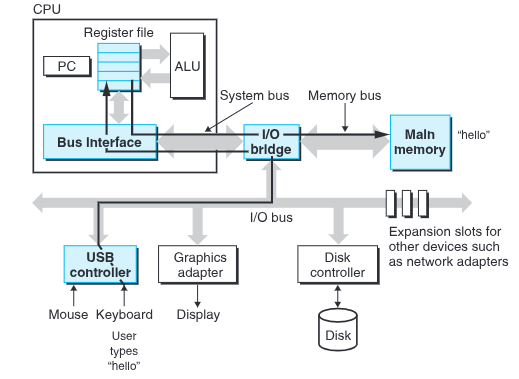
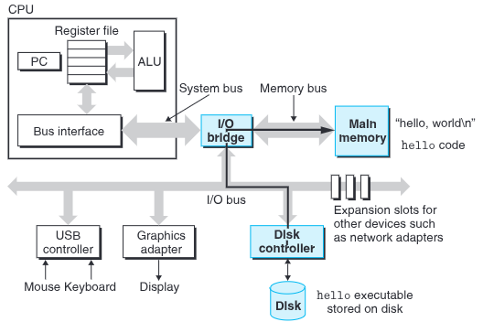
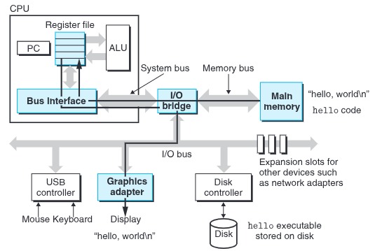
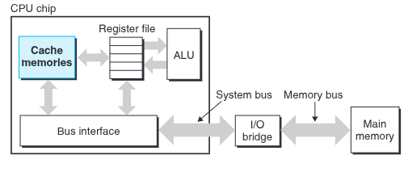

# 󰏢 week-1

> [!NOTE]
>
> 팀원: 동민님 + 세진님
>
> [백준 사이트](https://www.acmicpc.net/)
>   - id: chooselife

> [!tdd]
>
> - [x] 백준 아이디 만들기
>
> - [x] 코어시간 정하기
>   - 13:00~14:00
>   - 21:00~22:00

 

## (팀)코어타임 기록

### 1차

한주간 시간을 어떻게 보내기로 이야기 나눴다.

- CSAPP를 함께 읽기로 하였고, 문제는 저마다의 속도로 풀어가면서 어려운점, 이해 등을 나누기
  - 약속한 부분까지는 반드시 읽고 나누기

- 문제는 각자의 속도에 맞게 풀고, Do it등 책은 참고자료로 각자들 보기

- 코어타임이 아니어도 필요하면 언제나 도움을 주고받기

### 2차

> [!tdd]
>
> - [x] CSAPP 1.2까지 읽기
>
>   - **1.1 정보는 비트와 컨텍스트로 이루어진다**
>
>     - 사람은 다양한 문자를 사용하지만 컴퓨터는 비트 단위로 정보를 저장한다. 그래서
>       8비트(1바이트)씩 묶어서 ascii코드 따위를 표현한다. 그리고 어떤 바이트에 동일한 2진수
>       값이 표현되어 있더라도, '컨텍스트'라는 것에 따라 그 의미가 달라질 수 있다.
>
>     - 오로지 ascii 코드로만 이루어진 파일을 text파일, 그 외는 binary파일로 구분한다.
>
>   
>   - **1.2 프로그램은 다른 프로그램에 의해 다른 형태로 번역된다**
>   
>     c언어로 작성된 프로그램을 내 컴퓨터가 이해하고 실행할 수 있으려면 컴퓨터가 이해할 수 있게
>     변환해줘야한다. 여러가지 프로그램이 그 과정을 단계별로 진행하며 서로에게 결과물을 전달하고 마침
>     내 '실행가능 목적파일'이 된다.
>   
>     - preprocessing
>       - `#`으로 시작하는 전처리 명령어를 처리한다.
>         - `#include <something>`은 이후 단계에서 something을 사용할 수 있도록 준비한다.
>       - 주석을 제거한다.
>       - `.c  ==>  .i` (text 파일 / 전처리 결과물 또는 전처리 파일)
>     - compilation
>       - 전처리된 코드를 어셈블리 언어로 변환한다.
>       - `.i  ==>  .s` (text 파일 / 어셈블리 소스 파일)
>     - assembly
>       - 어셈블리 코드를 기계어(목적 파일)로 변환한다.
>       - `.s  ==>  .o` (binary 파일 / 목적 파일)
>     - linking
>       - 표준 라이브러리 등 필요한 목적 파일을 결합하여 하나의 실행 파일로 만든다.
>       - 실행파일(실행가능 목적파일)로 바꿔준다.
>       - `.o  ==>  실행파일` (binary 파일 / 실행가능 목적 파일 또는 실행 파일)
>   
>   
>     > [!qt] 한번에 binary파일로 만들지 뭐하러 어셈블리 언어로 변환했다가 또 변환하나?
>     >   󱞪 어셈블리 언어로 변환된 단계에서 디버깅 및 최적화가 다시한번 가능하다.
>     >   󱞪 CPU 아키텍쳐에 따라 적응하여 기계어로 변환할 수 있다. 적합하지 않게 기계어로 변환하면 당연히
>     >     실행이 안된다.
>     >   󱞪 역사적인 배경을 상상해보면 C언어는 존재하지 않고 어샘블리언어만 존재할 때가 있었을
>     >     것이다. 그때 이미 어샘블리언어 -> 기계어 변환 단계는 구성되어 있었을 것이다.
>   
>     > [!qt] 외부 라이브러리가 없으면 linking은 생략하나?
>     >   󱞪 목적 파일을 실행 가능한 파일 포맷으로 만들어주는 것도 linking의 역할이다. 즉, 빠지면 실행이
>     >     안된다.
>   
>     > [!qt] 왜 목적파일이라고 부르나?
>     >   󱞪 이름은 이름이다. 실행가능 파일이 되기 전 중간산출물들 이를 뿐이다. 
>     >     [answered](https://stackoverflow.com/a/8250014)

### 3차

> [!tdd]
>
> - [x] CSAPP 1.6까지 읽기
> 
> 
>   - **컴파일 시스템의 이해는 중요하다.**
>   
>     - _성능 최적화:_ 프로그래밍 언어가 기계어로 번역되어가는 과정을 알면 프로그램 작성시부터 효과적으
>       로 캐쉬 등을 사용할 수 있다.
>   
>     - _링커 이해하기:_ 여러개의 목적파일을 합칠 때의 순서 등 링커의 동작을 알지 못해 마주치는
>       에러가 많다.
>   
>     - _보안 약점 대비:_ 데이터가 어떻게 저장장치에 쌓이는지 이해하고 있어야 stack overflow같은 문제
>       또는 공격에 대비할 수 있다.
>   
>
>   
>   - **프로세서는 메모리에 저장된 인스트럭션을 읽고 해석(실행)한다.**
>   
>     - 쉘은 사람의 명령을 입력받아 실행한다. 이때 내장 쉘 명령이라면 그 명령을 수행하고, 그렇지
>       않다면 실행파일로 판단하여 저장장치에서 명령과 같은 이름의 실행파일을 찾아 실행한다.
>   
>     - 키워드 (전체 내용을 알고 나서 이해하기 좋다.)
>       
>       >  - word: bus를 통해 한번에 이동하는 데이터의 단위. CPU의 레지스터에도 word단위로 데이터가
>       >    저장된다. 시스템마다 word를 이루는 바이트수는 정해져있다.
>       >
>       >  - bus: 데이터의 이동 경로에 해당하는 회로. `ex) I/O bus, System bus, Memory bus`
>       >
>       >  - 입출력장치: 외부세계와의 연결을 담당. 컨트롤러나 어댑터를 이용해서 I/O bus에 연결된다.
>       >  - register: CPU가 작업을 처리하기 위해 사용하는 가장 빠른 속도의 저장장치. 목적에 따라 다양한
>       >    register가 있으며, 이를 일컬어 register file이라 한다.
>       >
>       >  - pc(program counter): register의 일종이며, 매우 특별한 것으로 이다음 작업으로 어떤
>       >    instruction을 수행해야할지 가리키는 주소값을 가지고 있다. 기본적으로는 순차적으로 다음 칸의
>       >    메모리에 접근하게 되어있다. `ex) +1,  +1,  +1, jump, +1, ...`
>       >
>       >  - instruction: 메모리에 로딩된 기계어 작업 내용. Instruction Set Architecture라는 규약이
>       >    있고, 이것을 얼만큼 지원하는지에 따라 CPU의 동작이 다르다.
>       >
>       >    ex) - store(메모리에 저장)
>       >        - load(메모리에서 꺼내오기)
>       >        - operate(ALU로 연산하기)
>       >        - jump(다음 실행할 instruction을 가르키는 특정 주소를 PC에 담기)
>       >
>       >  - ALU(Arithmetic Logical Unit): 산술 및 논리 연산자. 두개의 register에서 값을 받아와 연산한
>       >    뒤 결과인 새로운 값과 주소값을 register에 돌려준다.
>   
>   
>      - `hello.c` **프로그램이 실행되기까지의 여정**
>   
>         > 1. reading the 'hello' command from the keyboard 
>         > 
>         > 2. loading the executable from disk into main memory 
>         > 
>         > 3. writing the output string from memory to the display 
>   
>   
>   
>   - **캐시가 중요하다.**
>     
>     - 실행가능 프로그램이 실행되는 과정에서 보듯, 시스템은 정보를 한곳에서 다른 곳으로 이동시키는
>       일에 많은 시간을 보낸다.
>     - 프로세서-메모리(주기억장치)간 속도의 격차는 지속적으로 늘고있다.
>     - 이를 위하여 도입된 것이 캐시다.
>       - 자주 사용될 것으로 예상되는 데이터를 캐쉬에 저장 해 둔다.
>         - 프로그램의 '지역성 경향'(지엽적 영역의 코드와 데이터를 엑세스하는 경향)을 활용한 아이디어
>         - 자주 사용되는 만큼 본래 저장공간 이상의 높은 효율을 보여준다.
>         - _그래서 캐쉬를 잘 다루는 것은 개발자가 프로그램의 성능을 개선하는 중요한 열쇠이다._
>       - 프로세서와 메모리 사이를 위한 L1, L2, L3캐시가 있다.
>     - 
>   
>
>   
>   - **저장장치들은 계층구조를 이룬다.**
>     - 가장 빠른 레지스터부부터 네트워크를 통해 접근하는 원격지의 저장소까지 속도와 비용이 비례한다.
>     - 주요 아이디어는 두 저장장치 사이에 중간 정도의 속도를 가지는 저장소를 추가로 두어 캐쉬 역할을
>       하게 한다는 것이다.
>     - _프로그래머는 전체 메모리 계층구조에 대한 지식을 활용할 수도 있다._

### 4차

> [!tdc]
>
> - [c] 1.7 ~ 1.10 모두 읽기

CSAPP 책을 이해하느라 시간을 많이 보내다보니 알고리즘 문제 풀이는 우리팀 모두 한참 뒤쳐져있었다.
그래서 잠시 책은 미루기로 하였다.
처음 일요일을 맞이하여 다소 긴장이 풀어진것도 분명 있어보였다.

### 5차

> [!tdd]
>
> - [c] 1.7 ~ 1.10 모두 읽기
> - [x] 1.7 ~ 1.9 모두 읽기
> 
>   - **운영체제는 하드웨어를 관리한다.**
>   
>     OS의 존재 의의는 손쉽고 안전한 하드웨어 관리다. 수많은 하드웨어를 저마다의 방식으로 명령을
>     기다린다면 소프트웨어 개발은 비효율적일 것이다. 응용 프로그램이 제멋대로 하드웨어를 조작하는
>     것도 문제가 될 것이다.
>   
>     그래서 실행파일은 OS(커널)를 통하여 하드웨어(processor, memory, i/o devices)에 엑세스한다.
>   
>     이때 디스크, 네트워크 등 입출력장치를 '파일'로 추상화하고, 이와 함께 주기억장치를 포함하여
>     '가상메모리'로 추상화하고, 이 모두와 함께 프로세서를 포함하여 '프로세스'로 추상화한다.
>   
>     - `Process`
>   
>       > 실행중인 프로그램에 대한 OS의 추상화. 동시에 여러개의 프로세스를 실행시킬 수
>       > 있는데, 이때 '동시에'라는 말은 여러 프로세스간에 instruction 순서가 섞인다는 의미이다.
>       >
>       > OS는 context switching이라는 방법으로 이러한 교차실행을 수행한다. OS는 프로세스를 실행하는데
>       > 필요한 모든 상태정보를 추적하며, 이 정보들은 아래를 포함한다.
>       >
>       >  - Program Counter
>       >  - 레지스터파일
>       >  - Stack Pointer
>       >  - 메인메모리의 현재 값
>       >  - 일부 커널 데이터
>       >
>       > context switching은 메모리에 상주하는 커널에 의해 관리된다.
>       >
>       > > [!qt] 컨텍스트 정보는 어디에 저장되는걸까? 메인메모리의 현재 값까지 포함하면 데이터 양도 많을것 같은데
>       > >   󱞪 `Process Control Block(PCB)`라고, 커널 메모리에 위치한다. 단, '메인메모리의 현재 값'이란
>       > >     프로세스가 사용하는 메모리(코드, 데이터, 스택 등) 전체를 의미하는데 원래부터 메모리에
>       > >     있기 때문에 별도로 복사하지는 않는다. 단지, `메모리 맵, 페이지 테이블 등` 정보만 PCB에
>       > >     저장한다.
>       >
>       > > [!qt] 메모리 맵
>       > >   󱞪 해당 프로세스의 가상메모리에서 어떤 (가상)주소범위가 코드, 데이터, 스택, 힙에 해당하는지
>       > >     범위를 나타낸다. `/proc/<pid>/maps` 파일에 해당한다.
>       >
>       > > [!qt] 페이지
>       > >   󱞪 시스템은 가상 주소 메모리를 일정 크기 단위로 관리하는데, 이때 한 단위를 '페이지(page)'로 구분한다.
>       >
>       > > [!qt] 페이지 테이블
>       > >   󱞪 메모리맵의 가상 주소를 실제 주소(물리 주소)로 변환할 수 있는 맵핑 정보
>       >
>       >
>       > - `Thread`: 단일 프로세스는 다수의 Thread(실행유닛)으로 구성되어있다. 프로세스들 사이보다
>       >   데이터 공유가 쉽고 효율적이라는 특징이 있다.
>       >
>       >   > [!qt] Thread는 왜 Thread라고 불릴까?
>       >   >   󱞪 뜻: a line of reasoning or train of thought that connects the parts in a sequence 
>       >   >     (as of ideas or events)
>        
>   
>     - `Virtual memory`:
>   
>       > 운영체제가 각 프로세스에게 제공하는 **논리적(추상적) 주소 공간**
>       >
>       >    - **가상 메모리의 특징**
>       >
>       >      - **프로세스마다 독립적**으로 0번지부터 시작하는 큰 주소 공간을 가짐
>       >      - 이 공간은 실제 물리 메모리와 1:1로 대응하지 않음
>       >      - 실제로는 운영체제가 페이지 테이블을 통해  "가상 주소 → 물리 주소"로 **동적으로 매핑**
>       >
>       >      - `요구 페이징(demand paging)`: _가상메모리의 모든 데이터가 실제 메모리에 항상 올라와 있는 것은 아니다._
>       >        - **필요한 데이터만 실제 메모리(RAM)에 올리고,** 나머지는 디스크(예: 스왑 영역, 파일 등)에 존재
>       >        - 프로세스의 진행에 따라 Program Counter가 가상메모리의 메모리맵에 있는 어떤 주소를 실행하려는데
>       >          만약 해당 가상주소가 _아직 물리 메모리에 할당되지 않은 경우_ `page fault (interupt)`를 발생시킨다.
>       >          그러면 이제 커널이 해당 데이터 위치를 확인하고 데이터를 읽어서 물리메모리에 로딩하는것
>       >
>       >        > [!qt] 무엇이 프로세스 실행 최초에 필요한 메모리인지 누가/언제 판단?
>       >        >   󱞪 ELF헤더, 진입점 등 OS의 로더(loader)가 판단한다. 단, 개발자가 명시적으로 지정할 수
>       >        >     있다. `ex) mlock, MAP_POPULATE 옵션 등`
>       >
>       >        > [!qt] 가상 주소 공간을 구획한 '페이지'가 물리 메모리의 위치로 매핑될 때는 왜 페이지가 아니라 '프레임'이라는 단위를 쓰는거야?
>       >        >   󱞪 논리적 공간과 물리적 공간의 구분을 명확히 표현하기 위해서
>       >
>       >      - **페이지 테이블에** "가상 주소 → 물리 주소 변환표"
>       >      - **메모리 맵에** "어떤 주소 범위에 무엇이 있는지 정보"
>       >
>       >    - `Memory Management Unit (MMU)`
>       >
>       >      - CPU와 물리 메모리(RAM) 사이에 위치, 가상 주소 공간과 물리 메모리 사이의 "자동 변환기"이자 "보안관"
>       >      - 주요 역할:
>       >        - 가상 주소 → 물리 주소 변환
>       >        - 메모리 접근 권한 검사 (읽기/쓰기/실행 권한, 접근 금지 영역 등)
>       >        - 페이지 폴트 감지 (필요한 페이지가 메모리에 없을 때 OS에 알림)
>     
>   
>     - `File`
>       
>       각종 입출력 장치에 대한 추상화. 모든 입출력은 파일을 읽고 쓰는 행위이다.
> 
> 
> 
>
> - **시스템은 네트워크를 사용하여 다른 시스템과 통신한다.**
> 
>   네트워크도 하나의 입출력 장치이다.
>   디스크와 메모리 사이에 데이터가 이동하던것이, 단지 네트워크를 통한 외부 시스템과 메모리 사이에
>   데이터 이동으로 바뀔 뿐이다.

> [!NOTE] 혜성처럼 나타나서 알려주셨다. 성함이...!?
> 
>
> - **유저모드`User Mode`와 커널모드`Kernel Mode`, 시스템 콜`System Call`**
>
>   시스템의 상태는 유저모드와 커널모드가 있다. 이때 유저모드는 하드웨어 등 직접 접근이 불가하다.
>   그래서 아래와 같은 작업들이 필요하면 커널에 도움을 요청해야한다.
>     - 하드웨어, 메모리, 시스템 자원에 접근
>
>   이때 유저모드의 프로세스가 **시스템 콜**을 통해 커널에게 요청을 전달한다.
>   커널모드로 작업을 완료하면 다시 유저모르도 복귀한다.
>
>
> - **인터럽트`Interrupt`**
>  
>   - CPU의 현재 작업 흐름을 강제 중단하고 제어를 넘기는 신호
>   - CPU는 인터럽트가 발생했는지 계속해서 확인한다.
>   - 종류:
>     - hardware 인터럽트: 키보드 입력, 네트워크 패킷 도착, 타이머 등 외부 장치에서 발생
>     - software 인터럽트: 프로그램이 의도적으로 발생시키는 인터럽트 (예: 시스템 콜, 예외 처리)
>     - 페이지 폴트도 일종의 인터럽트다.

  

### 6차

> [!tdd]
>
> - [x] 1.9 ~ 1장 끝까지 모두 읽기
>
>   - **동시성과 병렬성**
>   
>     단일 프로세서로는 동시성을 확보하는 것이 한계였지만, 하드웨어 기술이 발전함에 따라
>     멀티프로세서(멀티코어) 및 멀티쓰레딩(하이퍼쓰레딩) 기술이 등장하여 진짜 병렬 컴퓨팅이 개인용
>     컴퓨터에도 흔해지게 되었다.
>      
>     멀티프로세서 방식은는 단순하다. 실제로 코어가 여럿인 것이다. 여럿이서 여러 일을 실제로 동시에
>     한다.(여러 프로세스의 인스트럭션이 순서가 섞인채로 실행되는 동시성과는 다르다!)
>   
>     모든 코어가 각각 register, L1/L2캐시를 개별적으로 보유한 한편, L3캐시 및 메모리 컨트롤러부터는 
>     공유한다.
>   
>   
>     - 쓰레드 수준 **동시성**
>   
>       > 쓰레드 수준 병렬성이 아니다. 즉, 하드웨어 계층에서 멀티 쓰레딩의 활용이란 실제로 프로그램을
>       > **병렬 실행하는 것은 아니다.** 인스트럭션 수준의 동시성이 아닌 쓰레드 수준의 **동시성 개념을 갖게**
>       > 되었다는 말이다. 다만, 동시에 실행되는것처럼 환상을 이르키는 것 뿐 아니라, 실제로 **CPU 활용율을
>       > 향상시킨다.**
>       >
>       > 어떻게 CPU 활용율을 향상시킬까?
>       >
>       > 논리코어라는 말이 등장한다. 논리코어들은 PC, register file을 개별적으로 가지고 있다. 하지만
>       > 실제 연산 장치(ALU, FPU 등)는 공유한다. 즉, 하나의 연산력에 여러 컨텍스트 정보를 상시 가지고
>       > 있는 것이다. 몸은 하나인데 머리는 여럿이랄까? ~원래는 호빵맨처럼 머리를 다른데서 가져와야
>       > 했는데, 처음부터 달려있달까...~ 따라서 컨텍스트 스위칭 비용을 줄여준다.
>       >
>       > CPU 활용율을 높이는 것은 이 때문만은 아니다. 하기한 것 외에도 다양한 이유로 CPU가 놀고있을 수
>       > 있다. 이렇게 유휴 공간이 있을 때 다른 실행컨텍스트가 파이프라인을 채우는 방식이다.
>       >
>       >  - 메모리 대기(메모리 접근 지연)  
>       >  - 분기 예측 실패  
>       >  - 파이프라인 버블  
>   
>        
>     - 인스트럭션 수준 병렬성
>   
>       > 2개 인스트럭션 사이에 의존성이 없는 경우 프로세서 사이클당 한 개 이상의 인스트럭션을 실행할
>       > 수 있는 기술을 말한다. 이것을 고려하여 코드를 작성할 수 있다.
>   
>   
>     - 싱글 인스트럭션, 다중 데이터 병렬성(SIMD)
>   
>       > 대개 영상, 소리, 동영상 데이터 처리를 위한 응용 프로그램의 속도를 개선하기 위해 제공된다.
>       > 특정 작업을 위한 특정 인스트럭션이 Instruction Set Architecture의 구성으로 포함되어
>       > 제공된다는 것이다. 우리 개발자는 이 기술이 어떻게 추상화 되었는지 알고 활용하면 된다.

