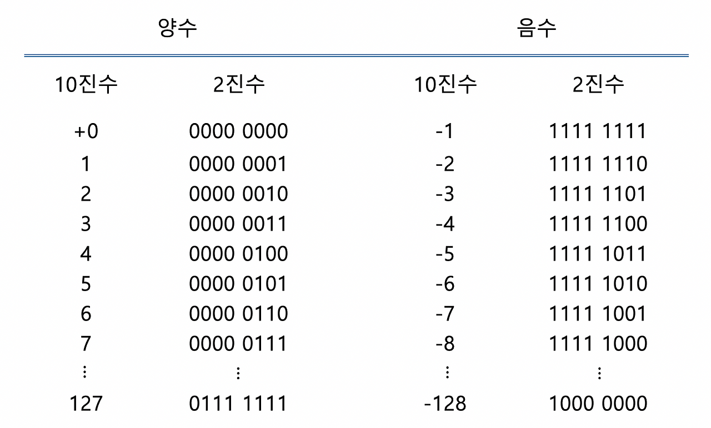

# 󰏢 week-2


> [!nt]
>
> 팀원: 임익화님 +김현서님
>


> [!tdd]
>
> - [x] 코어시간 정하기
>   - 20:00~21:00


> [!td]
>
> - [ ] 스택, 큐, 우선순위큐 하/중 모두 풀어보기, ~ 2025-09-13 (토)
> - CSAPP 4꼭지를 하루/하루/이틀/이틀로 읽고 공유하기
>   - [x] 1/4 정보의 저장
>     - [ ] 끝까지 읽고 정리해보기
>   - [x] 2/4 정수의 표시
>     - [ ] 끝까지 읽고 정리해보기
>   - [c] 3/4 정수의 산술연산
>   - [c] 4/4 부동소수점
>   - [ ] 3/4, 4/4 연습문제 선별하여 풀어보고 둘러보고 공유하기


> [!td]
>
> - [ ] 1920	하	이분 탐색	수 찾기
> - [ ] 2805	중	이분 탐색	나무 자르기
> - [ ] 2110	중	이분 탐색	공유기 설치
> - [ ] 2470	중	이분 탐색	두 용액
> - [ ] 11053	상	이분 탐색	가장 긴 증가하는 부분 수열
> - [ ] 8983	상	이분 탐색	사냥꾼
> - [ ] 2630	하	분할 정복	색종이 만들기
> - [ ] 1629	중	분할 정복	곱셈
> - [ ] 6549	중	분할 정복	히스토그램에서 가장 큰 직사각형
> - [ ] 10830	상	분할 정복	행렬 제곱
> - [ ] 2261	상	분할 정복	가장 가까운 두 점
> - [x] 10828	하	스택	스택
> - [x] 10773	하	스택	제로
> - [x] 9012	하	스택	괄호
> - [x] 17608	하	스택	막대기
> - [x] 2493	중	스택	탑
> - [c] 10000	중	스택	원 영역
> - [ ] 2504	상	스택	괄호의 값
> - [ ] 2812	상	스택	크게 만들기
> - [x] 18258	하	큐	큐 2
> - [x] 2164	하	큐	카드2
> - [x] 11866	하	큐	요세푸스 문제 0
> - [ ] 3190	중	큐	뱀
> - [x] 11279	하	우선순위 큐	최대 힙
> - [ ] 1655	중	우선순위 큐	가운데를 말해요
> - [ ] 1715	중	우선순위 큐	카드 정렬하기
> - [ ] 13334	상	우선순위 큐	철로


> [!qt] 좋은 팀멤버로 함께하기 위해 나는 구체적으로 무엇을 하고있는가?
>   󱞪 


> [!lg] Log 2025-09-13
>
> "CSAPP의 정해진 영역을 완벽히 이해하는 것에만 치중하기보다, 알고리즘 외에도 앞으로 해 나갈 c언어 관련
> 공부에도 어느정도 시간을 배분을 고려해보자"
> "CSAPP에서도 근시일 내 다루게 될 영역을 특히 중점적으로 살펴보자"


## 자료구조 & 알고리즘


> [!nt] 알고리즘 문제에서 제한시간을 활용하는법
>
> _2025-09-13 익화님이 알려주셨다._
>
> 알고리즘 문제에는 시간/메모리 제한이 있다. 그리고 이를 잘 활용하면 애초부터 부적합한 풀이 전략을
> 제외할 수 있다.
>
> - **how to?**
>
>   > [예시문제](https://www.acmicpc.net/problem/11279)
>   > 위 예시문제에서는 제한시간이 1초 주어진다. 그리고 거의 언제나 `연산의 개수 N(1 ≤ N ≤ 100,000)`가
>   > 주어진다. 한편 고수들의 전언에 따르면 백준에서는 **1억번/초** 연산을 한단다.
>   >
>   > 이때 만약 내가 시간복잡도 O(n)에 해당하는 for loop를 2중으로 수행한다면 100,000 * 100,000 =
>   > 1백억번 연산을 해야한다. 그럼 시간을 100초 주더라도 안될 일이란거다.
>   >
>   > 따라서 문제의 서두부터 주어지는 **제한시간**과 **연산회수**만 보고도 시간복잡도에 따라 일부
>   > 알고리즘 등 문제 해결 전략을 제외할 수 있는 것이다.


> [!nt] 자료구조 또는 알고리즘을 전부 직접 구현할 수 있어야 하는것은 아니다.
>
> _2025-09-13 현서님이 조심스럽게 의견을 공유해주셨다._
>
> 알고리즘 또는 자료구조에 대하여 '이해'하는 것으로 충분한 경우가 있고 또 구현도 할줄 알면 좋은것도
> 있다. 물론 전부 다 할줄알면 좋겠지만, 선택과 집중이란게 있다는 말이다.
>
> 그러면 무엇은 구현을 할수있을만큼 알고 무엇은 그렇지 않은가? 너무 날로 먹을 생각 말고 직접 시행착오를
> 거치자. 그러다보면 우연히 얻는 대단한것도 있고, 고생스럽게 얻는 사소한 것도 있을것이다.


### 우선순위 큐

- 리스트로 구현: 넣기 O(1), 꺼내기 O(N)
- 힙(Heap)으로 구현: 넣기 O(logN), 꺼내기 O(logN)


## 정보의 표현과 처리(Chapter 2)


_* 복잡한 수식이나 계산은 제외_

### 정보의 저장

비트에는 단순히 0과 1 단 두가지만 기록할 수 있지만, 다발로 묶어서 표현할 수 있는 패턴에 의미를
부여하도록 약속된 해석방법(인코딩)을 적용한다면, 말그대로 약속된 의미를 나눌 수 있게 된다. 아무
의미 없는 비트들도 우리가 약속된 방식으로 통제한다면 그안에 소통가능한 의미를 담을 수 있다.

중요한 것은 약속된 방식을 이해하는 것이다. 컴퓨터로 `0.1 * 0.1`을 수십번 반복해보면 인간의
관점으로는 이해할 수 없는 결과가 나온다.

이처럼 컴퓨터의 관점에서 정보를 어떻게 저장하고 해석하는지를 제대로 알지 못하면 예상밖의 크고 작은
문제가 생길 수 있다.


#### 16진수 표시

- 16진수로 값을 표현하는 것은 인간을 위한 것이다. 사람이 컴퓨터의 출력을 보고 의미를 이해할 수
  있어야한다.

  근데 그게 기본 상태인 2진수로 표현되면, 할 수 있겠지만 보기가 어렵다. 효율적으로 2진수와
  매핑되면서 사람이 읽기 쉬운 진법이 16진수이기 때문에 널리 사용된다.

#### 데이터의 크기

- 모든 컴퓨터는 word size를 규격으로 가지는데, 이것은 **포인터의 정규 크기**에 해당한다.
- 하나의 가상주소가 하나의 word로 인코딩되기 때문에, 이것에 영향받는 가장 중요한 시스템 변수에
  가상주소공간의 크기가 있다.
  - 메모리 (참조)주소는 1byte당 하나씩 할당된다.
  - 32bit (word) architecture ==> 64bit (word) architecture가 보편화 되었다. 
    - 이것은 가상메모리 공간을 최대 4GB까지 활용할 수 있던것이 17,179,869,184GB까지 활용할 수 있는
      변화를 가져왔다.
    - 1byte당 주소값 1개가 할당되는데, 32비트에 담을 수 있는 주소값의 종류(경우의 수)는 2^32이기
      때문에 이런 계산이 나온다. 주소값을 구분할 수 있어야 메모리를 쓸 수 있으니까.

- 대부분의 64bit 컴퓨터는 32bit 시스템을 목표로 컴파일된 실행파일도 실행할 수 있다. 그러니까
  어떤 프로그램이 실행되는 조건은 실행되는 머신의 종류가 아니라 '어떻게 컴파일 되었는가'이다.

- C언어를 기준으로, 데이터 타입에 따라 크기가 다양하다.

#### 주소 지정과 바이트 순서

- 주소지정:

  multi-byte 객체는 (거의 모든 시스템에서) 연속된 바이트에 저장되며, 객체의 주소는 사용된
  바이트의 최소 주소를 갖는다.

  어떤 데이터의 값이 커서 여러 바이트에 걸쳐 저장된 경우, 예를들어 1000번, 1001번, 1002번
  byte에 걸쳐 저장된 경우 이 객체의 주소값은 1000번으로 한다는 의미다.

- 바이트 순서:

  멀티바이트 객체를 메모리에 저장할 때 항상 값이 그릇에 딱 맞는 크기는 아니다. 3개 바이트에 2.5개
  바이트 분량(실제로는 3바이트지만)의 데이터만 담을수도 있는 것이다. 이때 좌로 정렬, 우로정렬
  어디로 할 것이냐는 문제다. 단지 가장 중요한(시작부분) 바이트부터 저장할지 덜 중요한(끝부분)
  바이트부터 저장할지 차인데, 대부분의 인텔 호환 프로세서들은 리틀 엔디안 방식(뒤에서부터)으로만
  동작한다. 

  두 가지는 구현의 차이지 논리적으로는 차이가 없다. 다만 관습이 있을 뿐이다.

  몇몇 경우에는 이 부분이 문제가 되기는 하는데, 첫째는 서로 다른 바이트 순서를 가진 두 시스템이
  네트워크 통신을 할 때이다. 이에 대비하여 네트워크 송신측은 표준 방식으로 전달하고, 수신측은 받은
  데이터를 자기 자신에 맞게 변환하도록 하도록 한다.

  두번째는 인간이 직접 기계수준의 코드를 살펴볼 때이다. 사람이 눈으로 직접 보기 때문에 좌에서 우로 읽을지
  우에서 좌로 읽을지 당연히 알고 읽어야한다.

  세번째는 C언어의 cast나 union을 사용할 때다. 이것의 의미는 '같은 메모리 공간을 여러 타입으로
  해석'하는 것인데 이때 바이트 순서가 어느 방식이냐에 따라 저장된 값의 해석이 달라질 수 있다.

  한편 운영체제는 이 부분에 대하여 하드웨어의 요구사항에 맞춰야 한다.


#### 더 알아가기(코어타임에서 배운것)

1. ~컴퓨터의 산술연산은 모두 덧셈으로만 이루어진다.~ ==> 덧셈과 보수, 시프트 연산 등으로 구현할 수 있다.

  - 2의 보수를 활용해서 뺄셈도 덧셈으로 해 버린다.
  - 곱셈 나눗셈도 결국 여러번 더하거나 여러번 빼는 것이므로 마찬가지다.

    ```md
    # 예시: 7 - 5 (4비트 연산)

    1. 5의 2의 보수 구하기: 1010 + 1 = 1011
       (1의 보수는 각 비트 반전)
       (2의 보수는 각 비트 반전 + 1)

    2. 7 + 5의 2의 보수:
       7 = 0111
       0111 + 1011 = 10010
    3. 결과(5비트)에서 오버플로우(첫 번째 1) 무시: 0010
    4. 0010 = 2 (정답)
    ```


2. 부동소수점의 경우 2의 거듭제곱 분수만 정확히 표현할 수 있다. 그 외는 근사값을 가진다.

  - 컴퓨터의 실수 표현 정확성의 한계는 실수와 실수 사이에는 무한한 가지수의 실수가
    존재한다는 점에 기인한다.
    - 유한한 비트로 무한한 실수를 표현하는 것이 애초에 불가능하다.

  - 단, 2의 거듭제곱으로 나눈 수(`x/2^n`)에 해당하는 실수는 정확히 표현할 수 있다.

    ```md
    - 0.1 (10진수)  
      0.1은 10진수로는 정확히 표현되지만,  
      2진수로는 무한소수(0.0001100110011... 반복)로 나타나서  
      컴퓨터의 부동소수점(유한 비트)에서는 근사값으로만 저장됩니다.

    - 0.25 (10진수)  
      0.25는 2진수로 0.01이므로,  
      이진 부동소수점에서 정확하게 표현할 수 있습니다.
    ```

  - 다만 표현을 정확히 할 수 있는 실수끼리도 연산을 하게되면 오차는 발생한다. 연산과정에서
    정확히 표현할 수 없는 실수가 나타나기 때문.

    - 정확히 표현할 수 있는 실수끼리 계산하여 정확히 표현할 수 있는 실수가 나오는 계산의 경우
      계산 후에도 정확히 표현할 수 있다.

      - File Path: test.py
        ```python
        from decimal import Decimal, getcontext
        
        getcontext().prec = 50  # 정밀도
        
        print("============================== 분모가 2의 제곱수인 경우")
        
        # float 연산
        x = 1.0
        for _ in range(10):
            x *= 0.125
        
        print(f"float   : {x:.50f}")
        
        # decimal 연산
        y = Decimal("1.0")
        for _ in range(10):
            y *= Decimal("0.125")
        
        print(f"decimal : {y:.50f}")
        
        
        print("============================== 분모가 2의 제곱수가 아닌 경우")
        
        # float 연산
        x = 1.0
        for _ in range(10):
            x *= 0.12
        
        print(f"float   : {x:.50f}")
        
        # decimal 연산
        y = Decimal("1.0")
        for _ in range(10):
            y *= Decimal("0.12")
        
        print(f"decimal : {y:.50f}")
        ```


    - 단, 파이썬의 `float` 타입은 **signed double-precision floating point**(부호가 있는
      64비트 배정밀도 실수)인데, 이 범위를 벗어나는 값을 계산하면 당연히 오차가
      발생한다.(파이썬에서 특별한 보정을 하지 않았다면)


3. 비트연산

  - `<<` 또는 `>>` 기로를 사용하여 shift, unshift연산이라 하는데 비트를 옆으로 밀어버린다.

    예를들어 0001 4비트 가있다면 `<<` 연산으로 0010을 만들어 버린다. 반대 방향도 가능하다.

    한편 예시의 4비트에서 연산 후 결과인 0010에 가장 우측 0은 어디서 나타난 것일까? 실제로는 바로
    우측에 있던 비트가 넘어온 것이다. 이러면 연산의 결과가 오염되기 때문에 우리는 padding(0을
    넣어 덮어씌우기)을 해 주는 것이다.

    음수의 다만 해당 비트의 머리에 음수 표현이 있는 경우 언어마다 지원 여부가 다르지만 부호를
    보존하는 연산이 별도로 있거나 자동으로 부호를 보존하도록 하는 경우들이 있다.


### 정보의 저장

- **다루는 내용:**

  - 정수의 비트 폭이 변할 때(확장/잘림) 발생하는 현상과 주의점 설명
  - 부호 있는(signed), 부호 없는(unsigned) 정수의 차이와 사용 시 유의사항


- **필요성**

  - 타입 변환(캐스팅) 시 비직관적 동작·버그 예방에 필수
  - C 등 저수준 언어에서 비트 표현 이해 필요
  - unsigned 타입의 용도(메모리 주소, 비트 플래그 등) 이해에 도움


- **주요 내용**

  1. **부호 확장(Sign Extension)**
      - 음수는 부호 비트 복제, 양수는 0으로 확장
      - 2의 보수 표현에서 값이 유지됨을 수학적으로 설명

  2. **데이터 크기 및 타입 변환 순서**
      - short→unsigned 변환 시: 크기 먼저 변경 후 타입 변경
      - 예측 어려운 동작 발생 가능, 비트 시프트+타입 변환 주의

  3. **숫자 잘림(Truncation)**
      - 비트 수 줄이면 상위 비트 잘려 값 변경(오버플로우)
      - unsigned: x mod 2^k, signed: U2Tk(x mod 2k)로 결과 설명

  4. **부호 있는 vs. 부호 없는 정수 사용**
      - 암시적 캐스팅으로 버그 발생 가능(예: 배열 합산, 문자열 길이 비교)
      - unsigned 사용 자제 권장, 일부 언어는 지원하지 않음
      - 단, 비트 플래그·메모리 주소·모듈러 산술 등에서는 유용


#### 더 알아가기(코어타임에서 배운것)


- 프로그래밍에서 변수 등에 어떤 타입을 지정하는 것의 의미는, 해당 변수에 저장될 2진수 데이터를
  **어떻게 해석할 것인가**를 결정하는 것이다. 예를들어 동일한 10011000(2)이라는 1바이트 표현은
  해석의 잣대에 따라 다양한 의미로 해석될 수 있는 것이다.

  예를들어 C언어의 경우 아래와 같다.
  
  >   - **signed 정수형 (`signed char`, `short`, `int`, `long`, `long long`)**
  >     - _2의 보수_ 방식으로 해석
  >     - 최상위 비트가 부호(+, -)를 결정
  >     - 
  >       > 위 표를 언뜻보면 앞뒤가 안맞는 것 같을 수 있다. 범위 내 가 장큰 수인 127은 2진수
  >       > 표현이 0b0111_1111이다. 그리고 맨 앞자리가 부호랬으니, 그러면 -127은 부호에 해당하는
  >       > 맨 앞 비트만 바꿔서 0b1111_1111이 돼야하는거 아닌가? 그게 아니다.
  >       > 음수는 2의 보수 방식으로 표현한다. 즉, 1에 해당하는 0b0000_0001에 대응하여 -1을
  >       > 표현하는 2진수는 0b1111_1111이 된다.
  >       >
  >       > 그러니까 8비트로 표현할 수 있는 signed 정수중 가장 작은수인 -128은 양수 127에
  >       > 해당하는 0b0111_1111의 2의 보수인 0b1000_0001에서 1을 뺀 0b1000_0000이 되는 것이다.
  >       >
  >       > 한편, 일단 음수로 표현된 뒤에는 똑같이 2진수 덧셈 뺄셈을 하게된다.
  >
  >   - **unsigned 정수형 (`unsigned char`, `unsigned int` 등)**
  >     - 단순한 2진수 양수로 해석
  >     - 모든 비트가 값 자체를 의미
  >     - 예: 10000001 → 129 (8비트 기준)
  >
  >   - **char**
  >     - signed/unsigned 여부는 구현(컴파일러)에 따라 다름
  >     - 문자 저장 시에는 7비트, 0~127(ASCII)만 사용
  >     - 바이너리 데이터 저장 시에는 signed/unsigned에 따라 해석 달라짐
  >
  >   - **실수형 (`float`, `double`)**
  >     - IEEE 754 부동소수점 방식으로 해석
  >     - 부호, 지수, 가수로 비트 분할
  >     - 같은 비트라도 정수형과 완전히 다르게 해석
  >
  >   - **포인터형 (`int *`, `char *` 등)**
  >     - 메모리 주소로 해석. 수학적 값이 아님


- 32b word 시스템에서 주소값의 범위: `0x00000000 ~ 0xFFFFFFFF`

  `0x`는 16진수 표현이다. 웬 16진수?

  32b에는 당연히 2^32만큼 주소값을 표현할 수 있고, 이때 만약 2진수로 주소값을 보여준다면
  `0b0000......0000101` 총 32칸의 2진수를 봐야한다. 메모리를 들여다보며 디버깅을 할래도
  도저히 사람이 보고 이해할 수 없다.


- 타입 캐스팅 또는 union 명령에 의해 데이터 크기가 줄어드는 경우, 기존 값의 보존을 위해 대단한
  작업을 해주지 않는다. 말도 안되는것 같지만 단순히 '절삭'한다. 따라서 절삭 되는 방식으로도
  프로그램에 중대한 영향을 미치지 않는지 고려하여 타입 변환을 해야한다.(하지마라 웬만하면)


## (팀)코어타임 기록


### 1차

지난 주차와는 시작부터 분위기가 사뭇 달랐다. 익화님은 아주 기세가 좋으신것같다. 나도 똑같이
하기는 어렵거나 안좋을수도 있지만 기회가 되는만큼 어떻게 해가시나 들어보고 잘 배워보고싶다.

또 코어타임에 무엇을 나누는지도 되게 달랐다. 지난번은 각자나 누군가가 이해한 바를 공유(자신있거나
없어도 그냥 한번 해보거나)하면 그것을 서로 바로잡거나 의문을 가지거나, 모호한 부분을 발견해보는
식이었다. 그런데 오늘은, 특히 익화님은 자신이 공부한 것에서 중요하다고 생각한 부분을 아주 명확히
짚어서 발표(?) 준비를 해 와 주셨다.

덕분에 나는 생각지도 못하게 많이 배웠다. 혼자했으면 주제나 키워드별로 한두줄로 핵심을 요약하기
위해 상당히 공을 들였어야 했을텐데, 그냥 날로 먹은 것 같다. 게다가 설명도 아주 명쾌하게 해주셔서
이해하기도 아주 쉬웠다.

하지만 너무 잘해주셔서 부담도 생겼다. 내가 너무 안일하게 생각했나 싶었다. 물론 나도 주어진
시간동안 최선을 다해 이해해보려고 하긴 했는데, 일단 내가 잘 이해하는 것에 치중했지 다른
팀원들에게 무엇을 나눠야하는지에 대해서는 거의 생각해보지 않았었다.


### 2차

지식의 홍수다. 오늘도 거의 두시간 가량 이야길 나눴는데, 나는 듣고 이해하기 및 이해 안되는 부분
질문하기에 급급하다.

이번 팀에서 나는 거의 응석받이가 된 모양새다. 놀고있는건 아니지만 뭐랄까 이전까진 내 속도와
방식대로 해도 다른 팀원들에게 기여를 하고있다는 생각이 들었는데, 지금은 많이 아쉽고 조급해진다.

물론 함께 다루는 영역에 대해 적극적으로 질문하는 거라던지, 다른 사람의 설명을 이해해 보려고
하는것도 분명 도움이 될 수 있다. 쉽게 설명하는 능력이라던지, 비교적 모호하게 알고있던 것을
발견하는 것이라던지, 그 또한 얻어갈 수 있는 능력이 있는 사람이 얻어가는 것이리라. 정글에서도
적극적으로 권장한다 말하고있고 또 어느정도 의도된 바라고 생각한다.

하지만 그렇게 나 자신에게 주문(?)을 걸어도 좀 주눅들기도 하고 불안하기도 한 것은 어쩔 수 없는것같다.

그것을 애써 부정하기보단, 이 불안을 원동력으로 삼아 더 열심히 해보는 시간으로 만들어야겠다.
